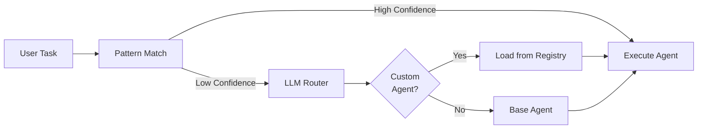

# Agent System Migration Plan

> **Status**: In Progress  
> **Target**: Move from legacy `agent/` to new `agents/server/` architecture  
> **Timeline**: Post v0.5.0 release

---

## Overview

The Rainy Aether agent system is transitioning from a **frontend-centric provider model** to a **server-side AgentKit architecture**. This migration brings:

- **Durability**: Inngest step functions for reliable execution
- **Scalability**: Server-side processing, not browser-bound
- **MCP Integration**: Native Model Context Protocol support
- **Multi-Agent**: Coordinated agent networks with routing

---

## Current Architecture

### Legacy System (`src/services/agent/`)

| Component | File | Purpose |
|-----------|------|---------|
| Providers | `providers/index.ts` | Model factory, configs |
| Gemini | `providers/gemini.ts` | Gemini API client |
| Groq | `providers/groq.ts` | Groq API client |
| Tools | `ToolRegistry.ts` | 71KB tool definitions |
| Service | `AgentService.ts` | Frontend agent orchestration |
| Prompts | `agentSystemPrompt.ts` | System prompts |
| History | `AgentHistoryService.ts` | Conversation persistence |
| Token | `TokenCounter.ts` | Token counting |

### New System (`src/services/agents/server/`)

| Component | File | Purpose |
|-----------|------|---------|
| Network | `agents/network.ts` | AgentKit network factory |
| Prompts | `agents/prompts.ts` | Dynamic system prompts |
| MCP Agents | `agents/mcp-agents.ts` | Context7-enabled agents |
| Tools | `tools/agentkit.ts` | Zod-validated tools |
| Executor | `tools/executor.ts` | Parallel execution, caching |
| MCP Client | `mcp/client.ts` | MCP server connections |
| Streaming | `streaming/events.ts` | SSE event types |
| Workflows | `workflows/inngest.ts` | Durable task execution |

---

## Migration Items

### Phase A: Provider Consolidation

**What**: Merge `agent/providers/` into `agents/server/`

| Legacy | New | Notes |
|--------|-----|-------|
| `providers/gemini.ts` | Use AgentKit `gemini()` | AgentKit handles API calls |
| `providers/groq.ts` | Use AgentKit `openai()` with baseUrl | Groq is OpenAI-compatible |
| `providers/index.ts` | `agents/network.ts` MODELS | Model IDs only |
| `providers/base.ts` | Not needed | AgentKit provides abstraction |
| `providers/retryUtils.ts` | Inngest step retries | Built into workflows |

**Why**:
- AgentKit abstracts provider details
- Inngest provides retry/durability
- Less code to maintain

### Phase B: Tool Migration

**What**: Consolidate `ToolRegistry.ts` into `tools/`

| Legacy | New | Notes |
|--------|-----|-------|
| `ToolRegistry.ts` (71KB) | `tools/schema.ts` + `tools/agentkit.ts` | Zod schemas, AgentKit format |
| Frontend tool calls | Server-side execution | Via Tauri bridge |
| `toolUtils.ts` | `tools/bridge.ts` | Handler registration |

**Why**:
- Zod provides runtime validation
- AgentKit `createTool` is type-safe
- Server execution is more reliable

### Phase C: Agent Unification

**What**: Replace legacy agents with AgentKit agents

| Legacy | New | Notes |
|--------|-----|-------|
| `brain/agents/*.ts` | `server/agents/network.ts` | Using `createAgent()` |
| `AgentService.ts` | `routes/brain.ts` + Inngest | HTTP API + durable workflows |
| Custom routing | AgentKit router | State-based decisions |

**Why**:
- AgentKit provides multi-agent orchestration
- State-based routing is more flexible
- Inngest ensures task completion

### Phase D: Model Adapter Removal

**What**: Remove `brain/modelAdapter.ts`

| Legacy | New | Notes |
|--------|-----|-------|
| `createInferenceAdapter()` | Direct AgentKit usage | No adapter needed |
| `selectModelForTask()` | `MODELS` in network.ts | Simple config |
| Metrics tracking | Inngest observability | Built-in monitoring |

**Why**:
- AgentKit handles inference
- Inngest provides observability
- Simpler architecture

---

## Model ID Reference

These model IDs should remain consistent across both systems during migration:

```typescript
// From src/services/agent/providers/index.ts
const PROVIDER_MODELS = {
  'gemini-flash-latest': 'gemini-3-flash-preview',
  'gemini-3-pro-thinking-high': 'gemini-3-pro-preview',
  'llama-3.3-70b': 'llama-3.3-70b-versatile',
};

// For AgentKit (src/services/agents/server/agents/network.ts)
const AGENTKIT_MODELS = {
  default: 'gemini-3-flash-preview',
  fast: 'gemini-3-flash-preview',
  smart: 'gemini-3-pro-preview',
};
```

---

## Files to Delete Post-Migration

After full migration, these files can be removed:

```
src/services/agent/
├── providers/           # Replaced by AgentKit
│   ├── base.ts
│   ├── gemini.ts
│   ├── groq.ts
│   └── index.ts
├── AgentService.ts      # Replaced by server routes
├── ToolRegistry.ts      # Replaced by tools/schema.ts
└── toolUtils.ts         # Replaced by tools/bridge.ts

src/services/agents/brain/
├── modelAdapter.ts      # No longer needed
└── network.ts           # Replaced by server/agents/network.ts
```

---

## Migration Checklist

- [ ] Phase A: Provider consolidation
  - [ ] Map all model IDs
  - [ ] Update thinking mode configs
  - [ ] Remove provider classes
- [ ] Phase B: Tool migration
  - [ ] Add missing tools to agentkit.ts
  - [ ] Verify Zod schemas match
  - [ ] Delete ToolRegistry.ts
- [ ] Phase C: Agent unification
  - [ ] Migrate brain/agents/* to server
  - [ ] Update AgentService callers
  - [ ] Remove legacy agent classes
- [ ] Phase D: Cleanup
  - [ ] Remove modelAdapter.ts
  - [ ] Remove brain/network.ts
  - [ ] Update all imports
- [ ] Testing
  - [ ] All tools execute correctly
  - [ ] MCP connections work
  - [ ] Streaming events flow
  - [ ] Inngest workflows complete

---

## Dynamic Subagent System

### Overview

The new agent system will support **dynamic, configurable subagents** following Anthropic's subagent patterns. Users can create custom agents with:

- **Custom System Prompts**: Define agent personality and behavior
- **Tool Permissions**: Granular control over which tools each agent can use
- **Model Selection**: Choose from multiple AI providers (Gemini, Claude, Grok, GPT)
- **Routing Hints**: Keywords and patterns for intelligent routing

### Subagent Configuration Schema

```typescript
interface SubagentConfig {
  // Identity
  name: string;                    // Display name
  id: string;                      // Unique identifier (kebab-case)
  description: string;             // When to use this agent
  version: string;                 // Semantic version
  
  // Behavior
  systemPrompt: string;            // Agent instructions
  model: ModelId;                  // AI model to use
  
  // Permissions
  tools: 'all' | string[];         // Tool whitelist
  
  // Routing
  keywords: string[];              // Keywords for pattern matching
  patterns: string[];              // Regex patterns
  priority: number;                // 0-100 routing priority
  
  // Execution
  maxIterations: number;           // Max tool call loops
  temperature: number;             // 0-2 creativity
  maxTokens?: number;              // Token limit
  
  // Metadata
  scope: 'user' | 'project';       // Storage scope
  enabled: boolean;                // Active flag
  tags: string[];                  // Organization
}
```

### File Structure

Subagents are stored as **Markdown files with YAML frontmatter**:

```markdown
---
name: Code Reviewer
id: code-reviewer
description: Expert code review specialist. Use after code changes.
model: claude-3.5-sonnet
tools:
  - read_file
  - grep_search
  - run_command
keywords: [review, check, analyze, quality]
priority: 80
---

You are a senior code reviewer ensuring high standards.

When invoked:
1. Run git diff to see recent changes
2. Review modified files
3. Check for common issues

Provide feedback organized by priority:
- Critical (must fix)
- Warnings (should fix)
- Suggestions (nice to have)
```

### Storage Locations

| Scope | Path | Priority | Use Case |
|-------|------|----------|----------|
| **Project** | `.rainy/agents/` | Highest | Team-shared agents |
| **User** | `~/.rainy/agents/` | Medium | Personal agents |
| **Plugin** | `plugins/*/agents/` | Lowest | Plugin-provided |

### Phase E: Subagent Registry

**What**: Implement dynamic subagent loading and management

| Component | New File | Purpose |
|-----------|----------|----------|
| Config Types | `server/types/SubagentConfig.ts` | Zod schemas + TypeScript types |
| Registry | `server/registry/SubagentRegistry.ts` | CRUD operations, priority resolution |
| Factory | `server/factory/SubagentFactory.ts` | Convert config → AgentKit agent |
| Workflows | `server/workflows/subagent-workflows.ts` | Execute custom agents |
| API Routes | `server/routes/subagent-routes.ts` | Tauri commands |
| Analytics | `server/analytics/analytics.ts` | Usage tracking (SQLite) |

**Why**:
- Enables user-created agents without code changes
- Supports team collaboration (project-scoped agents)
- Provides analytics for optimization

### Phase F: Enhanced Routing

**What**: Update routing to support custom subagents

| File | Changes |
|------|----------|
| `agents/routing-agent.ts` | Load custom agents, include in LLM prompt |
| `agents/network.ts` | Support dynamic agent types, fallback handling |
| `workflows/agentkit.ts` | Route to custom agents |

**Routing Flow**:



**Why**:
- Automatic agent selection
- Context-aware routing
- Learning from usage patterns

### Phase G: Multi-Model Support

**What**: Support multiple AI providers in subagents

| Provider | Models | Use Case |
|----------|--------|----------|
| **Gemini** | Flash, Pro | Fast/Smart (existing) |
| **Anthropic** | Claude 3.5 Sonnet, Haiku | Code review, analysis |
| **xAI** | Grok Beta | Real-time data tasks |
| **OpenAI** | GPT-4 | General purpose |

**Implementation**:

```typescript
// Model factory in SubagentFactory
private static getModel(modelName: string) {
  switch (modelName) {
    case 'gemini-3-flash':
      return gemini({ model: 'gemini-3-flash-preview' });
    case 'claude-3.5-sonnet':
      return anthropic({ model: 'claude-3-5-sonnet-latest' });
    case 'grok-beta':
      return openai({ 
        model: 'grok-beta',
        baseURL: 'https://api.x.ai/v1' 
      });
    // ...
  }
}
```

**Why**:
- Best model for each task type
- Cost optimization
- Vendor independence

---

## Frontend Integration

### New UI Components

| Component | File | Purpose |
|-----------|------|----------|
| Subagent Manager | `components/agents/SubagentManager.tsx` | List/Create/Edit UI |
| Subagent Editor | `components/agents/SubagentEditor.tsx` | Form for config |
| Agent Selector | `components/agents/AgentSelector.tsx` | Dropdown in chat |
| Analytics View | `components/agents/SubagentAnalytics.tsx` | Usage stats |

### User Workflows

1. **Create Custom Agent**
   - Click "New Agent" button
   - Fill in name, description, prompt
   - Select tools and model
   - Set routing keywords
   - Save (creates `.rainy/agents/agent-name.md`)

2. **Use Custom Agent**
   - Type task in chat
   - Router auto-selects agent
   - OR manually select from dropdown
   - Execute and view results

3. **View Analytics**
   - Open Analytics tab
   - See usage stats per agent
   - Success rates, avg duration
   - Popular tools used

---

## Migration Timeline

### v0.5.x (Current) - Foundation
- ✅ AgentKit network implemented
- ✅ MCP integration working
- ✅ Base agents (planner, coder, etc.)
- 🔄 Legacy system still primary

### v0.6.0 - Dynamic Subagents
- [ ] Subagent registry system
- [ ] Multi-model support
- [ ] Frontend management UI
- [ ] Analytics tracking
- [ ] Both systems run in parallel

### v0.6.5 - Migration Tools
- [ ] Auto-migration from legacy
- [ ] Deprecation warnings
- [ ] Full feature parity
- [ ] User testing period

### v0.7.0 - Legacy Removal
- [ ] Remove `Agent/` directory
- [ ] Update all imports
- [ ] New system is primary
- [ ] Legacy code archived

---

## Notes

- Keep legacy system functional until new system is fully tested
- Frontend components may need updates to call server API
- Consider backwards-compatible API routes during transition
- Dynamic subagent system enables rapid iteration without code changes
- Multi-model support provides flexibility for different task types
