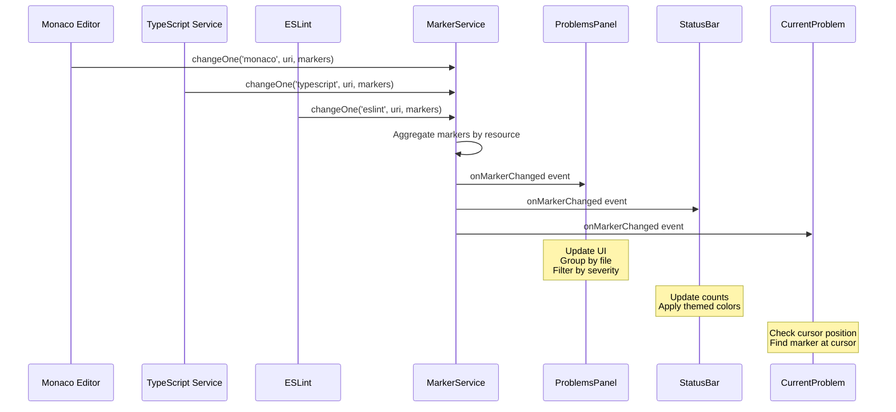

# Error System Implementation Plan - VS Code Parity

**Version:** 1.0
**Date:** 2025-11-08
**Author:** Claude Code
**Status:** Planning Phase

---

## Table of Contents

1. [Executive Summary](#executive-summary)
2. [Current State Analysis](#current-state-analysis)
3. [Architecture Overview](#architecture-overview)
4. [Phase 1: Core Marker Service Enhancement](#phase-1-core-marker-service-enhancement)
5. [Phase 2: Enhanced StatusBar Integration](#phase-2-enhanced-statusbar-integration)
6. [Phase 3: Current Problem Indicator](#phase-3-current-problem-indicator)
7. [Phase 4: Advanced ProblemsPanel Features](#phase-4-advanced-problemspanel-features)
8. [Phase 5: Theme Integration & Visual Polish](#phase-5-theme-integration--visual-polish)
9. [Testing Strategy](#testing-strategy)
10. [Migration Guide](#migration-guide)
11. [Performance Considerations](#performance-considerations)
12. [Future Enhancements](#future-enhancements)

---

## Executive Summary

This document outlines a comprehensive plan to upgrade Rainy Aether's error/diagnostic system to achieve feature parity with Visual Studio Code's robust marker and diagnostic infrastructure. The implementation is divided into **5 phases**, each building upon the previous one, with an estimated total development time of **23-33 hours**.

### Key Goals

- ✅ **Multi-owner marker tracking** - Support multiple diagnostic sources per file (TypeScript + ESLint + Custom)
- ✅ **Real-time cursor diagnostics** - Show current problem at cursor position in status bar
- ✅ **Enhanced navigation** - Click-to-navigate from problems to code locations
- ✅ **Code actions integration** - Quick fixes and refactoring suggestions
- ✅ **Visual consistency** - Match VS Code's theming and UX patterns
- ✅ **Performance optimization** - Handle 1000+ diagnostics efficiently

### Success Metrics

| Metric | Current | Target |
|--------|---------|--------|
| Diagnostic sources per file | 1 (Monaco only) | Unlimited (multi-owner) |
| Status bar indicators | 1 (aggregate count) | 2 (count + current problem) |
| Click-to-navigate | ❌ No | ✅ Yes |
| Quick fixes | ❌ No | ✅ Yes |
| Related information | ❌ No | ✅ Yes |
| Themed status items | ❌ No | ✅ Yes (error/warning kinds) |
| Settings integration | Partial | Complete (`problems.*` namespace) |

---

## Current State Analysis

### What We Have (Strong Foundation)

#### 1. DiagnosticService (`src/services/diagnosticService.ts`)

- ✅ Centralized singleton service
- ✅ Monaco marker listener integration
- ✅ Observer pattern with `subscribe()` method
- ✅ Statistics aggregation (`getStats()`)
- ✅ Multi-source support (Monaco, TypeScript, LSP, Git, Linter, Custom)
- ✅ Severity levels matching Monaco (Error=8, Warning=4, Info=2, Hint=1)

#### 2. ProblemsPanel (`src/components/ide/ProblemsPanel.tsx`)

- ✅ Diagnostic display grouped by file
- ✅ Filtering by severity (All, Errors, Warnings, Info)
- ✅ Source badges (monaco, typescript, git, linter)
- ✅ Color-coded severity icons
- ✅ Real-time updates via subscription

#### 3. StatusBar (`src/components/ide/StatusBar.tsx`)

- ✅ Aggregate problem count display
- ✅ Dynamic icon based on severity (✓ green, ⚠ yellow, ✖ red)
- ✅ Real-time statistics updates
- ✅ Tooltip with error/warning counts

#### 4. LSP Integration (`src/services/lsp/`)

- ✅ LSP client infrastructure
- ✅ Monaco adapter for language servers
- ✅ Diagnostic conversion pipeline

### What's Missing (Compared to VS Code)

| Feature | VS Code | Rainy Aether | Gap |
|---------|---------|--------------|-----|
| **Multi-owner tracking** | ✅ Per-owner resource maps | ❌ Single flat map | Need owner-based separation |
| **Current problem indicator** | ✅ Shows diagnostic at cursor | ❌ No cursor tracking | Missing component |
| **StatusBar entry kinds** | ✅ `error-kind`, `warning-kind` CSS | ❌ No themed items | Missing theme integration |
| **Activity badge** | ✅ Badge on Problems icon | ❌ No badge | Missing component |
| **Click navigation** | ✅ Navigate to file:line:col | ❌ No click handlers | Missing handlers |
| **Quick fixes** | ✅ Code actions menu | ❌ No quick fixes | Missing service |
| **Related information** | ✅ Shows related locations | ❌ No support | Missing UI |
| **Marker tags** | ✅ Unnecessary, Deprecated | ❌ No tags | Missing enum |
| **Settings** | ✅ `problems.*` namespace | ⚠️ Partial | Incomplete |
| **Performance** | ✅ Optimized for 10k+ markers | ⚠️ Unoptimized | Need virtual scrolling |

---

## Architecture Overview

### Current Architecture (Simplified)

```
┌─────────────────────────────────────────────────┐
│              Monaco Editor                      │
│         (Syntax/Semantic Errors)                │
└─────────────────┬───────────────────────────────┘
                  │ onDidChangeMarkers
                  ▼
┌─────────────────────────────────────────────────┐
│          DiagnosticService                      │
│   Map<id, Diagnostic>  (Flat structure)         │
└─────────────────┬───────────────────────────────┘
                  │ subscribe()
        ┌─────────┴─────────┐
        ▼                   ▼
  ProblemsPanel        StatusBar
  (List view)       (Aggregate count)
```

### Target Architecture (VS Code Parity)

```
┌───────────────────────────────────────────────────────┐
│         Multiple Diagnostic Sources                   │
│  ┌─────────┐  ┌─────────┐  ┌─────────┐  ┌─────────┐ │
│  │ Monaco  │  │TypeScript│  │ ESLint │  │ Custom  │ │
│  └────┬────┘  └────┬─────┘  └────┬────┘  └────┬────┘ │
└───────┼───────────┼──────────────┼────────────┼──────┘
        │           │              │            │
        └───────────┴──────────────┴────────────┘
                    │
                    ▼
┌─────────────────────────────────────────────────────┐
│           MarkerService (Enhanced)                  │
│  Map<owner, Map<resource, IMarker[]>>              │
│  - Multi-owner tracking                             │
│  - Resource-based indexing                          │
│  - Related information support                      │
│  - Marker tags (Unnecessary, Deprecated)            │
└─────────────────┬───────────────────────────────────┘
                  │ onMarkerChanged event
        ┌─────────┼─────────┬─────────────┬───────────┐
        │         │         │             │           │
        ▼         ▼         ▼             ▼           ▼
  ┌──────────┐ ┌────────┐ ┌──────────┐ ┌──────┐ ┌──────────┐
  │Problems  │ │Status  │ │ Current  │ │Badge │ │CodeAction│
  │Panel     │ │Bar     │ │ Problem  │ │      │ │Service   │
  └──────────┘ └────────┘ └──────────┘ └──────┘ └──────────┘
  - Grouped    - Themed   - Cursor      - Icon   - Quick fixes
  - Sortable   - Counts   - Tracking    - Count  - Refactors
  - Clickable  - Icons    - Settings            - Navigate
```

### Data Flow



---

## Phase 1: Core Marker Service Enhancement

**Priority:** 🔴 **CRITICAL**
**Estimated Time:** 8-12 hours
**Dependencies:** None
**Impact:** Foundation for all other phases

### Overview

Refactor `DiagnosticService` to match VS Code's `IMarkerService` architecture. This is the most critical phase as all subsequent features depend on this foundation.

### Goals

1. ✅ Multi-owner marker tracking (TypeScript + ESLint + Custom can coexist)
2. ✅ Resource-based indexing for performance
3. ✅ Related information support
4. ✅ Marker tags (Unnecessary, Deprecated)
5. ✅ Backward compatibility with existing code

### Implementation Details

#### 1.1 Enhanced Type Definitions

**File:** `src/services/markerService.ts` (renamed from `diagnosticService.ts`)

```typescript
/**
 * Marker severity levels (VS Code compatible)
 */
export enum MarkerSeverity {
  Hint = 1,
  Info = 2,
  Warning = 4,
  Error = 8,
}

/**
 * Marker tags for additional metadata
 */
export enum MarkerTag {
  Unnecessary = 1,  // Grayed out unused code
  Deprecated = 2,   // Strikethrough deprecated symbols
}

/**
 * Related information for complex diagnostics
 */
export interface IRelatedInformation {
  resource: string; // File URI
  message: string;
  startLineNumber: number;
  startColumn: number;
  endLineNumber: number;
  endColumn: number;
}

/**
 * Marker data structure (without owner/resource)
 */
export interface IMarkerData {
  severity: MarkerSeverity;
  message: string;
  startLineNumber: number;
  startColumn: number;
  endLineNumber: number;
  endColumn: number;
  code?: string | { value: string; target: string }; // Code with optional link
  source?: string; // Source of diagnostic (e.g., 'TypeScript', 'ESLint')
  tags?: MarkerTag[]; // Optional tags
  relatedInformation?: IRelatedInformation[]; // Related locations
}

/**
 * Full marker with owner and resource
 */
export interface IMarker extends IMarkerData {
  owner: string; // Who created this (e.g., 'typescript', 'eslint', 'custom')
  resource: string; // File URI
}

/**
 * Resource markers for batch operations
 */
export interface IResourceMarker {
  resource: string;
  markers: IMarkerData[];
}

/**
 * Options for reading markers
 */
export interface IMarkerReadOptions {
  owner?: string; // Filter by owner
  resource?: string; // Filter by resource
  severities?: MarkerSeverity[]; // Filter by severity
  take?: number; // Limit results
}

/**
 * Marker statistics
 */
export interface MarkerStatistics {
  errors: number;
  warnings: number;
  infos: number;
  hints: number;
  total: number;
  unknowns: number; // Markers with invalid severity
}
```

#### 1.2 MarkerService Class

**File:** `src/services/markerService.ts`

```typescript
type MarkerChangeListener = (resources: string[]) => void;

/**
 * Central marker service matching VS Code's IMarkerService
 */
export class MarkerService {
  // Owner -> Resource -> Markers
  private markers: Map<string, Map<string, IMarker[]>> = new Map();

  // Listeners for marker changes
  private listeners: Set<MarkerChangeListener> = new Set();

  // Monaco disposables
  private monacoDisposables: monaco.IDisposable[] = new Map();

  constructor() {
    this.initializeMonacoListener();
  }

  /**
   * Initialize Monaco marker listener (auto-register 'monaco' owner)
   */
  private initializeMonacoListener(): void {
    const disposable = monaco.editor.onDidChangeMarkers((uris) => {
      const changedResources: string[] = [];

      uris.forEach((uri) => {
        const resource = uri.toString();
        const monacoMarkers = monaco.editor.getModelMarkers({ resource: uri });

        // Convert Monaco markers to IMarkerData
        const markers: IMarkerData[] = monacoMarkers.map((m) => ({
          severity: m.severity as MarkerSeverity,
          message: m.message,
          startLineNumber: m.startLineNumber,
          startColumn: m.startColumn,
          endLineNumber: m.endLineNumber,
          endColumn: m.endColumn,
          code: typeof m.code === 'string' ? m.code : m.code?.value,
          source: m.source,
          tags: m.tags,
          relatedInformation: m.relatedInformation?.map((info) => ({
            resource: info.resource.toString(),
            message: info.message,
            startLineNumber: info.startLineNumber,
            startColumn: info.startColumn,
            endLineNumber: info.endLineNumber,
            endColumn: info.endColumn,
          })),
        }));

        this.changeOne('monaco', resource, markers);
        changedResources.push(resource);
      });

      if (changedResources.length > 0) {
        this.notifyListeners(changedResources);
      }
    });

    this.monacoDisposables.push(disposable);
  }

  /**
   * Change markers for a single resource and owner
   * Replaces all markers for this owner+resource combination
   */
  changeOne(owner: string, resource: string, markers: IMarkerData[]): void {
    if (!this.markers.has(owner)) {
      this.markers.set(owner, new Map());
    }

    const ownerMarkers = this.markers.get(owner)!;

    if (markers.length === 0) {
      // Remove all markers for this owner+resource
      ownerMarkers.delete(resource);
      if (ownerMarkers.size === 0) {
        this.markers.delete(owner);
      }
    } else {
      // Add owner and resource to each marker
      const fullMarkers: IMarker[] = markers.map((m) => ({
        ...m,
        owner,
        resource,
      }));

      ownerMarkers.set(resource, fullMarkers);
    }
  }

  /**
   * Change markers for multiple resources at once (batch operation)
   */
  changeAll(owner: string, data: IResourceMarker[]): void {
    const changedResources: string[] = [];

    data.forEach(({ resource, markers }) => {
      this.changeOne(owner, resource, markers);
      changedResources.push(resource);
    });

    if (changedResources.length > 0) {
      this.notifyListeners(changedResources);
    }
  }

  /**
   * Remove markers for specific resources and owner
   */
  remove(owner: string, resources: string[]): void {
    const ownerMarkers = this.markers.get(owner);
    if (!ownerMarkers) return;

    resources.forEach((resource) => {
      ownerMarkers.delete(resource);
    });

    if (ownerMarkers.size === 0) {
      this.markers.delete(owner);
    }

    this.notifyListeners(resources);
  }

  /**
   * Read markers with optional filtering
   */
  read(filter?: IMarkerReadOptions): IMarker[] {
    const results: IMarker[] = [];

    // Iterate through owners
    this.markers.forEach((ownerMarkers, owner) => {
      // Filter by owner if specified
      if (filter?.owner && owner !== filter.owner) {
        return;
      }

      // Iterate through resources
      ownerMarkers.forEach((markers, resource) => {
        // Filter by resource if specified
        if (filter?.resource && resource !== filter.resource) {
          return;
        }

        // Add markers to results
        markers.forEach((marker) => {
          // Filter by severity if specified
          if (filter?.severities && !filter.severities.includes(marker.severity)) {
            return;
          }

          results.push(marker);
        });
      });
    });

    // Apply limit if specified
    if (filter?.take && results.length > filter.take) {
      return results.slice(0, filter.take);
    }

    return results;
  }

  /**
   * Get marker statistics
   */
  getStatistics(): MarkerStatistics {
    const stats: MarkerStatistics = {
      errors: 0,
      warnings: 0,
      infos: 0,
      hints: 0,
      unknowns: 0,
      total: 0,
    };

    const allMarkers = this.read();
    stats.total = allMarkers.length;

    allMarkers.forEach((marker) => {
      switch (marker.severity) {
        case MarkerSeverity.Error:
          stats.errors++;
          break;
        case MarkerSeverity.Warning:
          stats.warnings++;
          break;
        case MarkerSeverity.Info:
          stats.infos++;
          break;
        case MarkerSeverity.Hint:
          stats.hints++;
          break;
        default:
          stats.unknowns++;
      }
    });

    return stats;
  }

  /**
   * Subscribe to marker changes
   * Returns unsubscribe function
   */
  onMarkerChanged(listener: MarkerChangeListener): () => void {
    this.listeners.add(listener);
    return () => this.listeners.delete(listener);
  }

  /**
   * Notify listeners of marker changes
   */
  private notifyListeners(resources: string[]): void {
    this.listeners.forEach((listener) => {
      try {
        listener(resources);
      } catch (error) {
        console.error('[MarkerService] Listener error:', error);
      }
    });
  }

  /**
   * Dispose the service
   */
  dispose(): void {
    this.monacoDisposables.forEach((d) => d.dispose());
    this.monacoDisposables = [];
    this.markers.clear();
    this.listeners.clear();
  }
}

// Singleton instance
let markerServiceInstance: MarkerService | null = null;

/**
 * Get the marker service instance
 */
export function getMarkerService(): MarkerService {
  if (!markerServiceInstance) {
    markerServiceInstance = new MarkerService();
  }
  return markerServiceInstance;
}

/**
 * Dispose the marker service
 */
export function disposeMarkerService(): void {
  if (markerServiceInstance) {
    markerServiceInstance.dispose();
    markerServiceInstance = null;
  }
}
```

#### 1.3 Backward Compatibility Layer

**File:** `src/services/diagnosticService.ts` (compatibility shim)

```typescript
/**
 * DEPRECATED: Use markerService.ts instead
 * This file provides backward compatibility
 */
import {
  MarkerService,
  getMarkerService,
  IMarker,
  MarkerSeverity,
  MarkerStatistics,
} from './markerService';

// Re-export with old names for backward compatibility
export { MarkerSeverity as DiagnosticSeverity };
export { MarkerStatistics as DiagnosticStats };
export type Diagnostic = IMarker;

export enum DiagnosticSource {
  Monaco = 'monaco',
  TypeScript = 'typescript',
  LSP = 'lsp',
  Git = 'git',
  Linter = 'linter',
  Custom = 'custom',
}

/**
 * @deprecated Use getMarkerService() instead
 */
export function getDiagnosticService(): {
  subscribe: (callback: (diagnostics: Diagnostic[], stats: MarkerStatistics) => void) => () => void;
  getStats: () => MarkerStatistics;
  addDiagnostic: (diagnostic: Diagnostic) => void;
  getAllDiagnostics: () => Diagnostic[];
  // ... other methods
} {
  const markerService = getMarkerService();

  return {
    subscribe: (callback) => {
      const handler = () => {
        const diagnostics = markerService.read();
        const stats = markerService.getStatistics();
        callback(diagnostics, stats);
      };

      return markerService.onMarkerChanged(handler);
    },

    getStats: () => markerService.getStatistics(),

    addDiagnostic: (diagnostic: Diagnostic) => {
      markerService.changeOne(diagnostic.owner, diagnostic.resource, [diagnostic]);
    },

    getAllDiagnostics: () => markerService.read(),

    // ... implement other methods as needed
  };
}

export { disposeMarkerService as disposeDiagnosticService };
```

### Migration Steps

1. ✅ Create `src/services/markerService.ts` with new implementation
2. ✅ Update `diagnosticService.ts` to be a compatibility shim
3. ✅ Update all imports gradually:
   - `ProblemsPanel.tsx`
   - `StatusBar.tsx`
   - LSP services
   - Extension API
4. ✅ Add unit tests for multi-owner scenarios
5. ✅ Remove compatibility shim once all code is migrated

### Testing Checklist

- [ ] Single owner works (Monaco only)
- [ ] Multiple owners work (Monaco + TypeScript)
- [ ] Markers are replaced correctly per owner+resource
- [ ] Related information is preserved
- [ ] Marker tags are preserved
- [ ] Statistics are accurate
- [ ] Listeners receive correct resource URIs
- [ ] Performance with 1000+ markers is acceptable

### Files to Create/Modify

| File | Type | Description |
|------|------|-------------|
| `src/services/markerService.ts` | **NEW** | Core marker service implementation |
| `src/services/diagnosticService.ts` | **MODIFY** | Backward compatibility shim |
| `src/types/markers.ts` | **NEW** | Type definitions |
| `src/services/lsp/lspService.ts` | **MODIFY** | Use new marker service |
| `src/components/ide/ProblemsPanel.tsx` | **MODIFY** | Use new marker service |
| `src/components/ide/StatusBar.tsx` | **MODIFY** | Use new marker service |

---

## Phase 2: Enhanced StatusBar Integration

**Priority:** 🔴 **HIGH**
**Estimated Time:** 4-6 hours
**Dependencies:** Phase 1
**Impact:** High visibility, immediate user value

### Overview

Upgrade the StatusBar to match VS Code's visual design, including themed status bar entry types, proper icon rendering, and click handlers.

### Goals

1. ✅ StatusBar entry kinds (`error`, `warning`, `standard`, `prominent`)
2. ✅ Themed CSS for each entry type
3. ✅ VS Code-style problem counter format
4. ✅ Click handler to toggle Problems panel
5. ✅ Tooltip improvements

### Implementation Details

#### 2.1 StatusBar Entry Types

**File:** `src/types/statusbar.ts` (new)

```typescript
/**
 * StatusBar entry kind determines visual styling
 */
export type StatusBarEntryKind =
  | 'standard'   // Default appearance
  | 'warning'    // Yellow background
  | 'error'      // Red background
  | 'prominent'  // Highlighted
  | 'remote'     // Remote development indicator
  | 'offline';   // Offline mode indicator

export const StatusBarEntryKinds: StatusBarEntryKind[] = [
  'standard',
  'warning',
  'error',
  'prominent',
  'remote',
  'offline',
];

/**
 * StatusBar entry interface
 */
export interface IStatusBarEntry {
  id: string;
  name: string; // Accessible name for screen readers
  text: string; // Display text (supports icons)
  ariaLabel?: string; // ARIA label
  tooltip?: string | React.ReactNode; // Hover tooltip
  command?: string; // Command to execute on click
  onClick?: () => void; // Click handler
  kind?: StatusBarEntryKind; // Visual styling
  backgroundColor?: string; // Custom background (overrides kind)
  color?: string; // Custom foreground (overrides kind)
  order: number; // Display order
  position: 'left' | 'right'; // Alignment
}

/**
 * StatusBar item component props
 */
export interface IStatusBarItemProps {
  entry: IStatusBarEntry;
  onClick?: (entry: IStatusBarEntry) => void;
}
```

#### 2.2 StatusBar CSS Styling

**File:** `src/styles/statusbar.css` (new)

```css
/* StatusBar base styles */
.statusbar-item {
  display: flex;
  align-items: center;
  gap: 4px;
  padding: 0 8px;
  height: 24px;
  font-size: 12px;
  white-space: nowrap;
  transition: background-color 150ms ease, color 150ms ease;
  cursor: pointer;
}

.statusbar-item:hover {
  background-color: var(--statusBarItem-hoverBackground);
}

/* Error kind */
.statusbar-item.error-kind {
  color: var(--statusBarItem-errorForeground);
  background-color: var(--statusBarItem-errorBackground);
}

.statusbar-item.error-kind:hover {
  color: var(--statusBarItem-errorHoverForeground);
  background-color: var(--statusBarItem-errorHoverBackground);
}

/* Warning kind */
.statusbar-item.warning-kind {
  color: var(--statusBarItem-warningForeground);
  background-color: var(--statusBarItem-warningBackground);
}

.statusbar-item.warning-kind:hover {
  color: var(--statusBarItem-warningHoverForeground);
  background-color: var(--statusBarItem-warningHoverBackground);
}

/* Prominent kind */
.statusbar-item.prominent-kind {
  color: var(--statusBarItem-prominentForeground);
  background-color: var(--statusBarItem-prominentBackground);
}

.statusbar-item.prominent-kind:hover {
  color: var(--statusBarItem-prominentHoverForeground);
  background-color: var(--statusBarItem-prominentHoverBackground);
}

/* Remote kind */
.statusbar-item.remote-kind {
  color: var(--statusBarItem-remoteForeground);
  background-color: var(--statusBarItem-remoteBackground);
}

/* Offline kind */
.statusbar-item.offline-kind {
  color: var(--statusBarItem-offlineForeground);
  background-color: var(--statusBarItem-offlineBackground);
}

/* Icon spacing */
.statusbar-item svg {
  width: 14px;
  height: 14px;
}
```

#### 2.3 StatusBar Item Component

**File:** `src/components/ide/StatusBarItem.tsx` (new)

```typescript
import React from 'react';
import { IStatusBarItemProps } from '@/types/statusbar';
import { cn } from '@/lib/cn';

/**
 * Individual status bar item component
 */
export const StatusBarItem: React.FC<IStatusBarItemProps> = ({ entry, onClick }) => {
  const handleClick = () => {
    if (onClick) {
      onClick(entry);
    }
  };

  const className = cn(
    'statusbar-item',
    entry.kind && `${entry.kind}-kind`,
    !entry.onClick && !entry.command && 'cursor-default'
  );

  const style: React.CSSProperties = {
    backgroundColor: entry.backgroundColor,
    color: entry.color,
  };

  return (
    <div
      className={className}
      style={style}
      onClick={handleClick}
      title={typeof entry.tooltip === 'string' ? entry.tooltip : undefined}
      aria-label={entry.ariaLabel || entry.name}
      role="button"
      tabIndex={0}
    >
      {/* Render text with icon support */}
      <span dangerouslySetInnerHTML={{ __html: entry.text }} />
    </div>
  );
};
```

#### 2.4 Enhanced StatusBar Component

**File:** `src/components/ide/StatusBar.tsx` (major update)

```typescript
import React, { useEffect, useState } from 'react';
import { getMarkerService, MarkerStatistics } from '@/services/markerService';
import { IStatusBarEntry } from '@/types/statusbar';
import { StatusBarItem } from './StatusBarItem';
import { XCircle, AlertCircle, CheckCircle, GitBranch, Zap } from 'lucide-react';
import { cn } from '@/lib/cn';
import './../../styles/statusbar.css';

const StatusBar: React.FC = () => {
  const [stats, setStats] = useState<MarkerStatistics>({
    errors: 0,
    warnings: 0,
    infos: 0,
    hints: 0,
    unknowns: 0,
    total: 0,
  });

  useEffect(() => {
    const markerService = getMarkerService();

    const unsubscribe = markerService.onMarkerChanged(() => {
      setStats(markerService.getStatistics());
    });

    // Initial load
    setStats(markerService.getStatistics());

    return unsubscribe;
  }, []);

  /**
   * Create problems status bar entry (VS Code style)
   */
  const getProblemsEntry = (): IStatusBarEntry => {
    const hasErrors = stats.errors > 0;
    const hasWarnings = stats.warnings > 0;

    // Format: "$(error) 5 $(warning) 3 $(info) 2"
    const parts: string[] = [];

    // Always show errors and warnings
    parts.push(`<svg>...</svg> ${stats.errors}`); // Error icon + count
    parts.push(`<svg>...</svg> ${stats.warnings}`); // Warning icon + count

    // Only show info if > 0
    if (stats.infos > 0) {
      parts.push(`<svg>...</svg> ${stats.infos}`); // Info icon + count
    }

    const text = parts.join(' ');
    const tooltip = `${stats.errors} errors, ${stats.warnings} warnings, ${stats.infos} info`;

    return {
      id: 'status.problems',
      name: 'Problems',
      text,
      tooltip,
      ariaLabel: tooltip,
      command: 'workbench.actions.view.toggleProblems',
      kind: hasErrors ? 'error' : hasWarnings ? 'warning' : 'standard',
      order: 50,
      position: 'left',
      onClick: () => {
        // Toggle problems panel
        console.log('Toggle problems panel');
      },
    };
  };

  const statusItems: IStatusBarEntry[] = [
    getProblemsEntry(),
    // ... other items (git, encoding, language, etc.)
  ];

  const leftItems = statusItems
    .filter((item) => item.position === 'left')
    .sort((a, b) => a.order - b.order);

  const rightItems = statusItems
    .filter((item) => item.position === 'right')
    .sort((a, b) => a.order - b.order);

  return (
    <div className="flex items-center justify-between bg-background border-t border-border h-6">
      <div className="flex items-center">
        {leftItems.map((item) => (
          <StatusBarItem key={item.id} entry={item} />
        ))}
      </div>

      <div className="flex items-center">
        {rightItems.map((item) => (
          <StatusBarItem key={item.id} entry={item} />
        ))}
      </div>
    </div>
  );
};

export default StatusBar;
```

#### 2.5 Theme Color Tokens

**File:** `src/themes/index.ts` (add colors)

```typescript
export interface ThemeColors {
  // ... existing colors

  // StatusBar Item - Error
  '--statusBarItem-errorForeground': string;
  '--statusBarItem-errorBackground': string;
  '--statusBarItem-errorHoverForeground': string;
  '--statusBarItem-errorHoverBackground': string;

  // StatusBar Item - Warning
  '--statusBarItem-warningForeground': string;
  '--statusBarItem-warningBackground': string;
  '--statusBarItem-warningHoverForeground': string;
  '--statusBarItem-warningHoverBackground': string;

  // StatusBar Item - Prominent
  '--statusBarItem-prominentForeground': string;
  '--statusBarItem-prominentBackground': string;
  '--statusBarItem-prominentHoverForeground': string;
  '--statusBarItem-prominentHoverBackground': string;

  // StatusBar Item - Remote/Offline
  '--statusBarItem-remoteForeground': string;
  '--statusBarItem-remoteBackground': string;
  '--statusBarItem-offlineForeground': string;
  '--statusBarItem-offlineBackground': string;
}

// Example theme definition (Dark theme)
export const darkTheme: Theme = {
  // ... existing colors

  '--statusBarItem-errorForeground': '#ffffff',
  '--statusBarItem-errorBackground': 'hsl(0, 70%, 45%)', // Dark red
  '--statusBarItem-errorHoverForeground': '#ffffff',
  '--statusBarItem-errorHoverBackground': 'hsl(0, 70%, 50%)', // Lighter red

  '--statusBarItem-warningForeground': '#ffffff',
  '--statusBarItem-warningBackground': 'hsl(40, 90%, 45%)', // Dark yellow/orange
  '--statusBarItem-warningHoverForeground': '#ffffff',
  '--statusBarItem-warningHoverBackground': 'hsl(40, 90%, 50%)',

  '--statusBarItem-prominentForeground': '#ffffff',
  '--statusBarItem-prominentBackground': 'hsl(210, 70%, 45%)', // Blue
  '--statusBarItem-prominentHoverForeground': '#ffffff',
  '--statusBarItem-prominentHoverBackground': 'hsl(210, 70%, 50%)',

  '--statusBarItem-remoteForeground': '#ffffff',
  '--statusBarItem-remoteBackground': 'hsl(150, 60%, 40%)', // Green

  '--statusBarItem-offlineForeground': '#666666',
  '--statusBarItem-offlineBackground': 'hsl(0, 0%, 30%)', // Gray
};
```

### Testing Checklist

- [ ] Error kind shows red background when errors > 0
- [ ] Warning kind shows yellow background when warnings > 0
- [ ] Standard kind shows default background when no problems
- [ ] Hover states work correctly
- [ ] Click handler toggles problems panel
- [ ] Tooltip displays correct counts
- [ ] Icons render properly
- [ ] Theme colors apply correctly
- [ ] Accessibility (ARIA labels, keyboard navigation)

### Files to Create/Modify

| File | Type | Description |
|------|------|-------------|
| `src/types/statusbar.ts` | **NEW** | StatusBar type definitions |
| `src/styles/statusbar.css` | **NEW** | StatusBar CSS styles |
| `src/components/ide/StatusBarItem.tsx` | **NEW** | Individual item component |
| `src/components/ide/StatusBar.tsx` | **MODIFY** | Enhanced StatusBar |
| `src/themes/index.ts` | **MODIFY** | Add color tokens |
| All theme files | **MODIFY** | Add statusbar colors |

---

## Phase 3: Current Problem Indicator

**Priority:** 🟡 **MEDIUM**
**Estimated Time:** 3-4 hours
**Dependencies:** Phase 1
**Impact:** Quality of life improvement

### Overview

Add a status bar indicator that shows the diagnostic at the current cursor position, matching VS Code's `ShowCurrentMarkerInStatusbarContribution`.

### Goals

1. ✅ Display current problem at cursor in status bar
2. ✅ Update in real-time as cursor moves
3. ✅ Respect settings (`problems.showCurrentInStatus`)
4. ✅ Show severity icon + message
5. ✅ Click to show quick fixes (Phase 4)

### Implementation Details

#### 3.1 Settings Integration

**File:** `src/stores/settingsStore.ts` (add setting)

```typescript
export interface EditorSettings {
  // ... existing settings

  // Problems settings
  'problems.showCurrentInStatus': boolean;
  'problems.sortOrder': 'severity' | 'position' | 'name';
  'problems.autoReveal': boolean;
}

const defaultSettings: EditorSettings = {
  // ... existing defaults

  'problems.showCurrentInStatus': true,
  'problems.sortOrder': 'severity',
  'problems.autoReveal': true,
};
```

#### 3.2 Current Problem Indicator Component

**File:** `src/components/ide/CurrentProblemIndicator.tsx` (new)

```typescript
import React, { useEffect, useState } from 'react';
import * as monaco from 'monaco-editor';
import { editorState } from '@/stores/editorStore';
import { getMarkerService, IMarker, MarkerSeverity } from '@/services/markerService';
import { useSettings } from '@/stores/settingsStore';
import { XCircle, AlertCircle, Info, Lightbulb } from 'lucide-react';
import { IStatusBarEntry } from '@/types/statusbar';
import { StatusBarItem } from './StatusBarItem';

/**
 * Shows the diagnostic at the current cursor position
 * Matches VS Code's ShowCurrentMarkerInStatusbarContribution
 */
export const CurrentProblemIndicator: React.FC = () => {
  const [currentMarker, setCurrentMarker] = useState<IMarker | null>(null);
  const settings = useSettings();

  // Check if feature is enabled
  const enabled = settings['problems.showCurrentInStatus'] ?? true;

  useEffect(() => {
    if (!enabled) return;

    const editor = editorState.view;
    if (!editor) return;

    // Subscribe to cursor position changes
    const cursorDisposable = editor.onDidChangeCursorPosition((e) => {
      updateCurrentMarker(e.position);
    });

    // Subscribe to marker changes
    const markerService = getMarkerService();
    const markerDisposable = markerService.onMarkerChanged((resources) => {
      const model = editor.getModel();
      if (!model) return;

      const uri = model.uri.toString();
      if (resources.includes(uri)) {
        const position = editor.getPosition();
        if (position) {
          updateCurrentMarker(position);
        }
      }
    });

    // Initial update
    const position = editor.getPosition();
    if (position) {
      updateCurrentMarker(position);
    }

    return () => {
      cursorDisposable.dispose();
      markerDisposable();
    };
  }, [enabled]);

  /**
   * Update current marker based on cursor position
   */
  const updateCurrentMarker = (position: monaco.Position) => {
    const editor = editorState.view;
    if (!editor) return;

    const model = editor.getModel();
    if (!model) return;

    const uri = model.uri.toString();
    const markerService = getMarkerService();

    // Get all markers for current file
    const markers = markerService.read({
      resource: uri,
      take: 500, // Reasonable limit
    });

    // Find marker at current cursor position
    const marker = markers.find((m) => {
      return (
        position.lineNumber >= m.startLineNumber &&
        position.lineNumber <= m.endLineNumber &&
        position.column >= m.startColumn &&
        position.column <= m.endColumn
      );
    });

    setCurrentMarker(marker || null);
  };

  /**
   * Get severity icon for marker
   */
  const getSeverityIcon = (severity: MarkerSeverity): React.ReactNode => {
    const iconProps = { size: 14 };

    switch (severity) {
      case MarkerSeverity.Error:
        return <XCircle {...iconProps} />;
      case MarkerSeverity.Warning:
        return <AlertCircle {...iconProps} />;
      case MarkerSeverity.Info:
        return <Info {...iconProps} />;
      case MarkerSeverity.Hint:
        return <Lightbulb {...iconProps} />;
      default:
        return null;
    }
  };

  /**
   * Handle click - show quick fixes or navigate
   */
  const handleClick = () => {
    if (!currentMarker) return;

    // TODO: Show quick fixes (Phase 4)
    console.log('Show quick fixes for:', currentMarker);
  };

  if (!enabled || !currentMarker) {
    return null;
  }

  const entry: IStatusBarEntry = {
    id: 'statusbar.currentProblem',
    name: 'Current Problem',
    text: `${currentMarker.message}`,
    tooltip: `${currentMarker.source || 'Unknown'}: ${currentMarker.message}`,
    ariaLabel: `Current Problem: ${currentMarker.message}`,
    onClick: handleClick,
    order: 100, // After problems counter
    position: 'left',
  };

  return (
    <div className="flex items-center gap-1">
      {getSeverityIcon(currentMarker.severity)}
      <StatusBarItem entry={entry} />
    </div>
  );
};
```

#### 3.3 Integration with StatusBar

**File:** `src/components/ide/StatusBar.tsx` (update)

```typescript
import { CurrentProblemIndicator } from './CurrentProblemIndicator';

const StatusBar: React.FC = () => {
  // ... existing code

  return (
    <div className="flex items-center justify-between bg-background border-t border-border h-6">
      <div className="flex items-center">
        {/* Problems counter */}
        {leftItems.map((item) => (
          <StatusBarItem key={item.id} entry={item} />
        ))}

        {/* Current problem indicator (NEW) */}
        <CurrentProblemIndicator />
      </div>

      <div className="flex items-center">
        {rightItems.map((item) => (
          <StatusBarItem key={item.id} entry={item} />
        ))}
      </div>
    </div>
  );
};
```

#### 3.4 Settings UI

**File:** `src/components/settings/ProblemsSettings.tsx` (new)

```typescript
import React from 'react';
import { useSettings, settingsActions } from '@/stores/settingsStore';

export const ProblemsSettings: React.FC = () => {
  const settings = useSettings();

  return (
    <div className="space-y-4">
      <h3 className="text-lg font-semibold">Problems Settings</h3>

      {/* Show current in status */}
      <div className="flex items-center justify-between">
        <div>
          <div className="font-medium">Show Current Problem in Status Bar</div>
          <div className="text-sm text-muted-foreground">
            Display the diagnostic at the current cursor position
          </div>
        </div>
        <input
          type="checkbox"
          checked={settings['problems.showCurrentInStatus']}
          onChange={(e) => {
            settingsActions.updateSetting('problems.showCurrentInStatus', e.target.checked);
          }}
        />
      </div>

      {/* Sort order */}
      <div className="flex items-center justify-between">
        <div>
          <div className="font-medium">Sort Problems By</div>
          <div className="text-sm text-muted-foreground">
            How to sort problems in the panel
          </div>
        </div>
        <select
          value={settings['problems.sortOrder']}
          onChange={(e) => {
            settingsActions.updateSetting('problems.sortOrder', e.target.value);
          }}
        >
          <option value="severity">Severity</option>
          <option value="position">Position</option>
          <option value="name">File Name</option>
        </select>
      </div>

      {/* Auto reveal */}
      <div className="flex items-center justify-between">
        <div>
          <div className="font-medium">Auto Reveal in Problems Panel</div>
          <div className="text-sm text-muted-foreground">
            Automatically show problem in panel when cursor moves
          </div>
        </div>
        <input
          type="checkbox"
          checked={settings['problems.autoReveal']}
          onChange={(e) => {
            settingsActions.updateSetting('problems.autoReveal', e.target.checked);
          }}
        />
      </div>
    </div>
  );
};
```

### Testing Checklist

- [ ] Indicator appears when cursor is on a diagnostic
- [ ] Indicator disappears when cursor moves away
- [ ] Icon matches diagnostic severity
- [ ] Message is truncated if too long
- [ ] Tooltip shows full message
- [ ] Setting toggles feature on/off
- [ ] Works with multiple files
- [ ] Updates when markers change
- [ ] Performance is acceptable (no lag when typing)

### Files to Create/Modify

| File | Type | Description |
|------|------|-------------|
| `src/components/ide/CurrentProblemIndicator.tsx` | **NEW** | Main component |
| `src/components/settings/ProblemsSettings.tsx` | **NEW** | Settings UI |
| `src/stores/settingsStore.ts` | **MODIFY** | Add settings |
| `src/components/ide/StatusBar.tsx` | **MODIFY** | Integrate component |

---

## Phase 4: Advanced ProblemsPanel Features

**Priority:** 🟡 **MEDIUM**
**Estimated Time:** 6-8 hours
**Dependencies:** Phase 1
**Impact:** Power user features

### Overview

Enhance the ProblemsPanel with VS Code-level features including click-to-navigate, quick fixes, related information, advanced filtering, and performance optimizations.

### Goals

1. ✅ Click-to-navigate from problem to code
2. ✅ Quick fixes and code actions
3. ✅ Related information display
4. ✅ Advanced filtering (by source, search, glob patterns)
5. ✅ Sorting options
6. ✅ Keyboard navigation
7. ✅ Virtual scrolling for performance
8. ✅ Multi-select and batch actions

### Implementation Details

#### 4.1 Click-to-Navigate

**File:** `src/components/ide/ProblemsPanel.tsx` (update)

```typescript
import { ideActions } from '@/stores/ideStore';
import { editorActions } from '@/stores/editorStore';

/**
 * Handle diagnostic click - navigate to file and position
 */
const handleDiagnosticClick = async (marker: IMarker) => {
  try {
    // Open file in editor
    await ideActions.openFile(marker.resource);

    // Wait for editor to be ready
    await new Promise((resolve) => setTimeout(resolve, 50));

    // Navigate to position
    const editor = editorState.view;
    if (!editor) return;

    // Set cursor position
    editor.setPosition({
      lineNumber: marker.startLineNumber,
      column: marker.startColumn,
    });

    // Reveal position in center of editor
    editor.revealPositionInCenter(
      {
        lineNumber: marker.startLineNumber,
        column: marker.startColumn,
      },
      monaco.editor.ScrollType.Smooth
    );

    // Focus editor
    editor.focus();

    // Optional: Select the range
    if (marker.endLineNumber && marker.endColumn) {
      editor.setSelection({
        startLineNumber: marker.startLineNumber,
        startColumn: marker.startColumn,
        endLineNumber: marker.endLineNumber,
        endColumn: marker.endColumn,
      });
    }
  } catch (error) {
    console.error('[ProblemsPanel] Navigation failed:', error);
  }
};
```

#### 4.2 Code Actions Service

**File:** `src/services/codeActionService.ts` (new)

```typescript
import * as monaco from 'monaco-editor';
import { IMarker } from './markerService';

/**
 * Code action kind
 */
export enum CodeActionKind {
  QuickFix = 'quickfix',
  Refactor = 'refactor',
  RefactorExtract = 'refactor.extract',
  RefactorInline = 'refactor.inline',
  RefactorRewrite = 'refactor.rewrite',
  Source = 'source',
  SourceOrganizeImports = 'source.organizeImports',
  SourceFixAll = 'source.fixAll',
}

/**
 * Code action interface
 */
export interface ICodeAction {
  title: string;
  kind: string;
  diagnostics?: IMarker[];
  isPreferred?: boolean;
  disabled?: string; // Reason if disabled
  edit?: monaco.editor.IWorkspaceEdit;
  command?: {
    id: string;
    title?: string;
    arguments?: any[];
  };
}

/**
 * Code action context
 */
export interface ICodeActionContext {
  only?: string; // Filter by kind
  trigger: 'manual' | 'auto';
  markers?: IMarker[];
}

/**
 * Code action service
 */
export class CodeActionService {
  /**
   * Get code actions for a range
   */
  async getCodeActions(
    uri: string,
    range: monaco.IRange,
    context: ICodeActionContext
  ): Promise<ICodeAction[]> {
    const model = monaco.editor.getModel(monaco.Uri.parse(uri));
    if (!model) return [];

    try {
      // Get code actions from Monaco
      const actions = await monaco.languages.getCodeActions(
        model,
        range,
        {
          type: context.trigger === 'manual'
            ? monaco.languages.CodeActionTriggerType.Manual
            : monaco.languages.CodeActionTriggerType.Auto,
          only: context.only,
        }
      );

      // Convert to our format
      return actions.actions.map((action) => ({
        title: action.title,
        kind: action.kind || CodeActionKind.QuickFix,
        isPreferred: action.isPreferred,
        disabled: action.disabled,
        edit: action.edit,
        command: action.command,
        diagnostics: context.markers,
      }));
    } catch (error) {
      console.error('[CodeActionService] Failed to get code actions:', error);
      return [];
    }
  }

  /**
   * Apply a code action
   */
  async applyCodeAction(action: ICodeAction): Promise<boolean> {
    try {
      // Apply workspace edit if present
      if (action.edit) {
        await this.applyWorkspaceEdit(action.edit);
      }

      // Execute command if present
      if (action.command) {
        await this.executeCommand(action.command.id, action.command.arguments);
      }

      return true;
    } catch (error) {
      console.error('[CodeActionService] Failed to apply code action:', error);
      return false;
    }
  }

  /**
   * Apply workspace edit
   */
  private async applyWorkspaceEdit(edit: monaco.editor.IWorkspaceEdit): Promise<void> {
    // Monaco's workspace edit is already structured
    // Just need to apply the edits to the editor
    if (!edit.edits || edit.edits.length === 0) return;

    for (const resourceEdit of edit.edits) {
      if ('resource' in resourceEdit && 'textEdit' in resourceEdit) {
        const model = monaco.editor.getModel(resourceEdit.resource);
        if (model) {
          model.pushEditOperations(
            null,
            [resourceEdit.textEdit],
            () => null
          );
        }
      }
    }
  }

  /**
   * Execute command
   */
  private async executeCommand(commandId: string, args?: any[]): Promise<void> {
    // TODO: Implement command execution
    // This would integrate with your command palette/system
    console.log('[CodeActionService] Execute command:', commandId, args);
  }
}

// Singleton instance
let codeActionServiceInstance: CodeActionService | null = null;

export function getCodeActionService(): CodeActionService {
  if (!codeActionServiceInstance) {
    codeActionServiceInstance = new CodeActionService();
  }
  return codeActionServiceInstance;
}
```

#### 4.3 Quick Fix Menu Component

**File:** `src/components/ide/QuickFixMenu.tsx` (new)

```typescript
import React, { useEffect, useState } from 'react';
import { IMarker } from '@/services/markerService';
import { getCodeActionService, ICodeAction } from '@/services/codeActionService';
import { Lightbulb, Sparkles } from 'lucide-react';
import { cn } from '@/lib/cn';

interface QuickFixMenuProps {
  marker: IMarker;
  onClose: () => void;
  position: { x: number; y: number };
}

export const QuickFixMenu: React.FC<QuickFixMenuProps> = ({ marker, onClose, position }) => {
  const [actions, setActions] = useState<ICodeAction[]>([]);
  const [loading, setLoading] = useState(true);

  useEffect(() => {
    loadCodeActions();
  }, [marker]);

  const loadCodeActions = async () => {
    setLoading(true);

    const service = getCodeActionService();
    const range = {
      startLineNumber: marker.startLineNumber,
      startColumn: marker.startColumn,
      endLineNumber: marker.endLineNumber,
      endColumn: marker.endColumn,
    };

    const codeActions = await service.getCodeActions(marker.resource, range, {
      trigger: 'manual',
      markers: [marker],
    });

    setActions(codeActions);
    setLoading(false);
  };

  const handleActionClick = async (action: ICodeAction) => {
    const service = getCodeActionService();
    const success = await service.applyCodeAction(action);

    if (success) {
      onClose();
    }
  };

  if (loading) {
    return (
      <div className="quick-fix-menu" style={{ left: position.x, top: position.y }}>
        <div className="p-2 text-sm text-muted-foreground">Loading...</div>
      </div>
    );
  }

  if (actions.length === 0) {
    return (
      <div className="quick-fix-menu" style={{ left: position.x, top: position.y }}>
        <div className="p-2 text-sm text-muted-foreground">No quick fixes available</div>
      </div>
    );
  }

  return (
    <div className="quick-fix-menu" style={{ left: position.x, top: position.y }}>
      <div className="p-1">
        {actions.map((action, index) => (
          <button
            key={index}
            className={cn(
              'w-full px-2 py-1 text-left text-sm hover:bg-muted rounded flex items-center gap-2',
              action.disabled && 'opacity-50 cursor-not-allowed'
            )}
            onClick={() => !action.disabled && handleActionClick(action)}
            disabled={!!action.disabled}
            title={action.disabled}
          >
            {action.isPreferred ? (
              <Sparkles size={14} className="text-yellow-500" />
            ) : (
              <Lightbulb size={14} className="text-blue-500" />
            )}
            <span>{action.title}</span>
          </button>
        ))}
      </div>
    </div>
  );
};
```

#### 4.4 Enhanced ProblemsPanel with All Features

**File:** `src/components/ide/ProblemsPanel.tsx` (major update)

```typescript
import React, { useEffect, useState, useMemo } from 'react';
import { FixedSizeList as List } from 'react-window';
import { XCircle, AlertCircle, Info, Lightbulb, X, Search, Filter } from 'lucide-react';
import { getMarkerService, IMarker, MarkerSeverity } from '@/services/markerService';
import { QuickFixMenu } from './QuickFixMenu';
import { cn } from '@/lib/cn';

interface FilterOptions {
  severity: 'all' | 'errors' | 'warnings' | 'info' | 'hints';
  source: string; // 'all' or specific owner
  searchText: string;
  excludePattern: string; // Glob pattern
}

interface SortOptions {
  by: 'severity' | 'position' | 'file' | 'source';
  order: 'asc' | 'desc';
}

const ProblemsPanel: React.FC<{ onClose?: () => void }> = ({ onClose }) => {
  const [markers, setMarkers] = useState<IMarker[]>([]);
  const [filter, setFilter] = useState<FilterOptions>({
    severity: 'all',
    source: 'all',
    searchText: '',
    excludePattern: '',
  });
  const [sort, setSort] = useState<SortOptions>({
    by: 'severity',
    order: 'desc',
  });
  const [selectedMarker, setSelectedMarker] = useState<IMarker | null>(null);
  const [quickFixMenu, setQuickFixMenu] = useState<{
    marker: IMarker;
    position: { x: number; y: number };
  } | null>(null);

  useEffect(() => {
    const markerService = getMarkerService();

    const unsubscribe = markerService.onMarkerChanged(() => {
      setMarkers(markerService.read());
    });

    // Initial load
    setMarkers(markerService.read());

    return unsubscribe;
  }, []);

  /**
   * Filter and sort markers
   */
  const processedMarkers = useMemo(() => {
    let result = [...markers];

    // Filter by severity
    if (filter.severity !== 'all') {
      const severityMap = {
        errors: MarkerSeverity.Error,
        warnings: MarkerSeverity.Warning,
        info: MarkerSeverity.Info,
        hints: MarkerSeverity.Hint,
      };
      result = result.filter((m) => m.severity === severityMap[filter.severity]);
    }

    // Filter by source
    if (filter.source !== 'all') {
      result = result.filter((m) => m.owner === filter.source);
    }

    // Filter by search text
    if (filter.searchText) {
      const search = filter.searchText.toLowerCase();
      result = result.filter((m) =>
        m.message.toLowerCase().includes(search) ||
        m.resource.toLowerCase().includes(search) ||
        m.source?.toLowerCase().includes(search)
      );
    }

    // TODO: Filter by exclude pattern (glob)

    // Sort
    result.sort((a, b) => {
      let comparison = 0;

      switch (sort.by) {
        case 'severity':
          comparison = b.severity - a.severity; // Higher severity first
          break;
        case 'position':
          comparison = a.startLineNumber - b.startLineNumber;
          break;
        case 'file':
          comparison = a.resource.localeCompare(b.resource);
          break;
        case 'source':
          comparison = (a.source || '').localeCompare(b.source || '');
          break;
      }

      return sort.order === 'asc' ? comparison : -comparison;
    });

    return result;
  }, [markers, filter, sort]);

  /**
   * Group markers by file
   */
  const groupedMarkers = useMemo(() => {
    const groups: Record<string, IMarker[]> = {};

    processedMarkers.forEach((marker) => {
      if (!groups[marker.resource]) {
        groups[marker.resource] = [];
      }
      groups[marker.resource].push(marker);
    });

    return groups;
  }, [processedMarkers]);

  /**
   * Handle marker click - navigate to file
   */
  const handleMarkerClick = async (marker: IMarker) => {
    setSelectedMarker(marker);

    // Navigate to file and position
    await ideActions.openFile(marker.resource);
    await new Promise((resolve) => setTimeout(resolve, 50));

    const editor = editorState.view;
    if (editor) {
      editor.setPosition({
        lineNumber: marker.startLineNumber,
        column: marker.startColumn,
      });
      editor.revealPositionInCenter(
        {
          lineNumber: marker.startLineNumber,
          column: marker.startColumn,
        },
        monaco.editor.ScrollType.Smooth
      );
      editor.focus();
    }
  };

  /**
   * Handle quick fix button click
   */
  const handleQuickFixClick = (marker: IMarker, event: React.MouseEvent) => {
    event.stopPropagation();

    const rect = event.currentTarget.getBoundingClientRect();
    setQuickFixMenu({
      marker,
      position: { x: rect.left, y: rect.bottom + 4 },
    });
  };

  /**
   * Get unique sources for filter dropdown
   */
  const sources = useMemo(() => {
    const uniqueSources = new Set(markers.map((m) => m.owner));
    return ['all', ...Array.from(uniqueSources)];
  }, [markers]);

  /**
   * Render individual marker item
   */
  const MarkerItem: React.FC<{ marker: IMarker; style?: React.CSSProperties }> = ({ marker, style }) => (
    <div
      className={cn(
        'px-3 py-2 hover:bg-muted/50 cursor-pointer transition-colors',
        selectedMarker?.resource === marker.resource &&
        selectedMarker?.startLineNumber === marker.startLineNumber &&
        'bg-muted'
      )}
      style={style}
      onClick={() => handleMarkerClick(marker)}
    >
      <div className="flex items-start gap-2">
        {/* Severity icon */}
        <div className="mt-0.5">
          {getSeverityIcon(marker.severity)}
        </div>

        {/* Content */}
        <div className="flex-1 min-w-0">
          <div className="flex items-center gap-2 mb-1">
            <span className="text-sm">{marker.message}</span>
            {marker.code && (
              <span className="text-xs text-muted-foreground">
                [{typeof marker.code === 'string' ? marker.code : marker.code.value}]
              </span>
            )}
          </div>

          <div className="flex items-center gap-2 text-xs text-muted-foreground">
            {/* Source badge */}
            <span className={cn('px-1.5 py-0.5 rounded text-xs font-medium', getSourceColor(marker.owner))}>
              {marker.owner}
            </span>

            {/* Location */}
            <span>
              Ln {marker.startLineNumber}, Col {marker.startColumn}
            </span>

            {/* File path */}
            <span className="truncate">
              {marker.resource.split('/').pop()}
            </span>
          </div>

          {/* Related information */}
          {marker.relatedInformation && marker.relatedInformation.length > 0 && (
            <div className="mt-2 ml-6 space-y-1">
              {marker.relatedInformation.map((info, idx) => (
                <div key={idx} className="flex items-center gap-2 text-xs text-muted-foreground">
                  <Info size={10} />
                  <span>{info.message}</span>
                  <span className="text-muted-foreground/70">
                    {info.resource}:{info.startLineNumber}
                  </span>
                </div>
              ))}
            </div>
          )}
        </div>

        {/* Quick fix button */}
        <button
          className="p-1 hover:bg-muted rounded transition-colors"
          onClick={(e) => handleQuickFixClick(marker, e)}
          title="Show quick fixes"
        >
          <Lightbulb size={14} />
        </button>
      </div>
    </div>
  );

  return (
    <div className="flex flex-col h-full bg-background border-t border-border">
      {/* Header with filters */}
      <div className="flex items-center justify-between px-3 py-2 border-b border-border">
        <div className="flex items-center gap-2">
          <h3 className="text-sm font-semibold">Problems</h3>
          <span className="text-xs text-muted-foreground">
            {processedMarkers.length} {processedMarkers.length === 1 ? 'problem' : 'problems'}
          </span>
        </div>

        <div className="flex items-center gap-2">
          {/* Filter controls */}
          <input
            type="text"
            placeholder="Search problems..."
            className="px-2 py-1 text-xs border border-border rounded bg-background"
            value={filter.searchText}
            onChange={(e) => setFilter({ ...filter, searchText: e.target.value })}
          />

          <select
            className="px-2 py-1 text-xs border border-border rounded bg-background"
            value={filter.source}
            onChange={(e) => setFilter({ ...filter, source: e.target.value })}
          >
            {sources.map((source) => (
              <option key={source} value={source}>
                {source === 'all' ? 'All Sources' : source}
              </option>
            ))}
          </select>

          {onClose && (
            <button
              onClick={onClose}
              className="p-1 hover:bg-muted rounded transition-colors"
              title="Close problems panel"
            >
              <X size={16} />
            </button>
          )}
        </div>
      </div>

      {/* Problems list (virtual scrolling for performance) */}
      <div className="flex-1 overflow-hidden">
        {processedMarkers.length === 0 ? (
          <div className="flex items-center justify-center h-full text-muted-foreground text-sm">
            No problems to display
          </div>
        ) : (
          <List
            height={600} // Adjust based on panel height
            itemCount={processedMarkers.length}
            itemSize={80} // Approximate height per item
            width="100%"
          >
            {({ index, style }) => (
              <MarkerItem marker={processedMarkers[index]} style={style} />
            )}
          </List>
        )}
      </div>

      {/* Quick fix menu */}
      {quickFixMenu && (
        <QuickFixMenu
          marker={quickFixMenu.marker}
          position={quickFixMenu.position}
          onClose={() => setQuickFixMenu(null)}
        />
      )}
    </div>
  );
};

export default ProblemsPanel;
```

### Testing Checklist

- [ ] Click navigates to correct file and position
- [ ] Quick fix menu displays available actions
- [ ] Code actions can be applied successfully
- [ ] Related information is displayed
- [ ] Search filtering works
- [ ] Source filtering works
- [ ] Sorting works for all options
- [ ] Virtual scrolling performs well with 1000+ markers
- [ ] Keyboard navigation works (arrow keys, Enter)
- [ ] Multi-select works (if implemented)

### Files to Create/Modify

| File | Type | Description |
|------|------|-------------|
| `src/services/codeActionService.ts` | **NEW** | Code actions service |
| `src/components/ide/QuickFixMenu.tsx` | **NEW** | Quick fix menu |
| `src/components/ide/ProblemsPanel.tsx` | **MAJOR UPDATE** | Enhanced panel with all features |
| `package.json` | **MODIFY** | Add `react-window` dependency |

---

## Phase 5: Theme Integration & Visual Polish

**Priority:** 🟢 **LOW**
**Estimated Time:** 2-3 hours
**Dependencies:** Phase 2
**Impact:** Visual consistency

### Overview

Add final visual polish, theme integration, and activity badge to match VS Code's appearance.

### Goals

1. ✅ Activity badge on Problems panel icon
2. ✅ Complete theme token coverage
3. ✅ Accessibility improvements (ARIA, keyboard nav)
4. ✅ Animation polish (hover states, transitions)
5. ✅ Responsive design for different panel sizes

### Implementation Details

#### 5.1 Activity Badge Component

**File:** `src/components/ide/ProblemsBadge.tsx` (new)

```typescript
import React, { useEffect, useState } from 'react';
import { getMarkerService, MarkerStatistics } from '@/services/markerService';
import { cn } from '@/lib/cn';

/**
 * Activity badge for Problems panel icon
 * Shows total problem count in sidebar
 */
export const ProblemsBadge: React.FC = () => {
  const [stats, setStats] = useState<MarkerStatistics>({
    errors: 0,
    warnings: 0,
    infos: 0,
    hints: 0,
    unknowns: 0,
    total: 0,
  });

  useEffect(() => {
    const markerService = getMarkerService();

    const unsubscribe = markerService.onMarkerChanged(() => {
      setStats(markerService.getStatistics());
    });

    // Initial load
    setStats(markerService.getStatistics());

    return unsubscribe;
  }, []);

  const total = stats.errors + stats.warnings + stats.infos;

  if (total === 0) {
    return null;
  }

  const title = `Total ${total} Problem${total > 1 ? 's' : ''}`;

  return (
    <div
      className={cn(
        'activity-badge',
        'absolute top-0 right-0 -mt-1 -mr-1',
        'min-w-[16px] h-4 px-1',
        'flex items-center justify-center',
        'text-[10px] font-semibold',
        'rounded-full',
        stats.errors > 0 ? 'bg-red-500 text-white' : 'bg-blue-500 text-white'
      )}
      title={title}
      aria-label={title}
    >
      {total > 99 ? '99+' : total}
    </div>
  );
};
```

#### 5.2 Complete Theme Token Definitions

**File:** `src/themes/index.ts` (final color additions)

```typescript
export interface ThemeColors {
  // ... existing colors

  // Problems Panel
  '--problemsErrorIcon-foreground': string;
  '--problemsWarningIcon-foreground': string;
  '--problemsInfoIcon-foreground': string;
  '--problemsHintIcon-foreground': string;

  // Activity Badge
  '--activityBarBadge-background': string;
  '--activityBarBadge-foreground': string;

  // StatusBar Items (complete set)
  '--statusBarItem-activeBackground': string;
  '--statusBarItem-hoverBackground': string;
  '--statusBarItem-prominentForeground': string;
  '--statusBarItem-prominentBackground': string;
  '--statusBarItem-prominentHoverForeground': string;
  '--statusBarItem-prominentHoverBackground': string;
  '--statusBarItem-errorForeground': string;
  '--statusBarItem-errorBackground': string;
  '--statusBarItem-errorHoverForeground': string;
  '--statusBarItem-errorHoverBackground': string;
  '--statusBarItem-warningForeground': string;
  '--statusBarItem-warningBackground': string;
  '--statusBarItem-warningHoverForeground': string;
  '--statusBarItem-warningHoverBackground': string;
  '--statusBarItem-remoteForeground': string;
  '--statusBarItem-remoteBackground': string;
  '--statusBarItem-offlineForeground': string;
  '--statusBarItem-offlineBackground': string;
}

// Dark theme example (complete)
export const darkTheme: Theme = {
  // ... existing colors

  // Problems Panel
  '--problemsErrorIcon-foreground': 'hsl(0, 70%, 60%)',
  '--problemsWarningIcon-foreground': 'hsl(40, 90%, 60%)',
  '--problemsInfoIcon-foreground': 'hsl(210, 70%, 60%)',
  '--problemsHintIcon-foreground': 'hsl(150, 60%, 50%)',

  // Activity Badge
  '--activityBarBadge-background': 'hsl(210, 70%, 50%)',
  '--activityBarBadge-foreground': '#ffffff',

  // StatusBar Items
  '--statusBarItem-activeBackground': 'hsla(0, 0%, 100%, 0.18)',
  '--statusBarItem-hoverBackground': 'hsla(0, 0%, 100%, 0.12)',

  '--statusBarItem-prominentForeground': '#ffffff',
  '--statusBarItem-prominentBackground': 'hsl(210, 70%, 45%)',
  '--statusBarItem-prominentHoverForeground': '#ffffff',
  '--statusBarItem-prominentHoverBackground': 'hsl(210, 70%, 50%)',

  '--statusBarItem-errorForeground': '#ffffff',
  '--statusBarItem-errorBackground': 'hsl(0, 70%, 45%)',
  '--statusBarItem-errorHoverForeground': '#ffffff',
  '--statusBarItem-errorHoverBackground': 'hsl(0, 70%, 50%)',

  '--statusBarItem-warningForeground': '#ffffff',
  '--statusBarItem-warningBackground': 'hsl(40, 90%, 45%)',
  '--statusBarItem-warningHoverForeground': '#ffffff',
  '--statusBarItem-warningHoverBackground': 'hsl(40, 90%, 50%)',

  '--statusBarItem-remoteForeground': '#ffffff',
  '--statusBarItem-remoteBackground': 'hsl(150, 60%, 40%)',

  '--statusBarItem-offlineForeground': '#666666',
  '--statusBarItem-offlineBackground': 'hsl(0, 0%, 30%)',
};

// Light theme example
export const lightTheme: Theme = {
  // ... existing colors

  // Problems Panel
  '--problemsErrorIcon-foreground': 'hsl(0, 70%, 50%)',
  '--problemsWarningIcon-foreground': 'hsl(40, 90%, 40%)',
  '--problemsInfoIcon-foreground': 'hsl(210, 70%, 50%)',
  '--problemsHintIcon-foreground': 'hsl(150, 60%, 40%)',

  // Activity Badge
  '--activityBarBadge-background': 'hsl(210, 70%, 50%)',
  '--activityBarBadge-foreground': '#ffffff',

  // StatusBar Items
  '--statusBarItem-activeBackground': 'hsla(0, 0%, 0%, 0.12)',
  '--statusBarItem-hoverBackground': 'hsla(0, 0%, 0%, 0.09)',

  '--statusBarItem-prominentForeground': '#ffffff',
  '--statusBarItem-prominentBackground': 'hsl(210, 70%, 50%)',
  '--statusBarItem-prominentHoverForeground': '#ffffff',
  '--statusBarItem-prominentHoverBackground': 'hsl(210, 70%, 45%)',

  '--statusBarItem-errorForeground': '#ffffff',
  '--statusBarItem-errorBackground': 'hsl(0, 70%, 50%)',
  '--statusBarItem-errorHoverForeground': '#ffffff',
  '--statusBarItem-errorHoverBackground': 'hsl(0, 70%, 45%)',

  '--statusBarItem-warningForeground': '#000000',
  '--statusBarItem-warningBackground': 'hsl(40, 90%, 50%)',
  '--statusBarItem-warningHoverForeground': '#000000',
  '--statusBarItem-warningHoverBackground': 'hsl(40, 90%, 45%)',

  '--statusBarItem-remoteForeground': '#ffffff',
  '--statusBarItem-remoteBackground': 'hsl(150, 60%, 45%)',

  '--statusBarItem-offlineForeground': '#999999',
  '--statusBarItem-offlineBackground': 'hsl(0, 0%, 80%)',
};
```

#### 5.3 Accessibility Enhancements

**File:** `src/components/ide/ProblemsPanel.tsx` (accessibility update)

```typescript
// Add ARIA attributes and keyboard navigation

const ProblemsPanel: React.FC = () => {
  // ... existing code

  // Keyboard navigation
  const handleKeyDown = (event: React.KeyboardEvent, marker: IMarker, index: number) => {
    switch (event.key) {
      case 'Enter':
      case ' ':
        event.preventDefault();
        handleMarkerClick(marker);
        break;
      case 'ArrowDown':
        event.preventDefault();
        // Focus next item
        focusMarkerAtIndex(index + 1);
        break;
      case 'ArrowUp':
        event.preventDefault();
        // Focus previous item
        focusMarkerAtIndex(index - 1);
        break;
      case 'Home':
        event.preventDefault();
        focusMarkerAtIndex(0);
        break;
      case 'End':
        event.preventDefault();
        focusMarkerAtIndex(processedMarkers.length - 1);
        break;
    }
  };

  return (
    <div
      className="flex flex-col h-full bg-background border-t border-border"
      role="region"
      aria-label="Problems Panel"
    >
      {/* ... header */}

      <div
        className="flex-1 overflow-auto"
        role="list"
        aria-label={`${processedMarkers.length} problems`}
      >
        {processedMarkers.map((marker, index) => (
          <div
            key={`${marker.resource}-${marker.startLineNumber}-${marker.startColumn}`}
            role="listitem"
            tabIndex={0}
            onKeyDown={(e) => handleKeyDown(e, marker, index)}
            aria-label={`${getSeverityLabel(marker.severity)}: ${marker.message} at line ${marker.startLineNumber}`}
          >
            <MarkerItem marker={marker} />
          </div>
        ))}
      </div>
    </div>
  );
};
```

#### 5.4 Animation Polish

**File:** `src/styles/problems.css` (new)

```css
/* Problems Panel animations */
.problems-panel {
  animation: slideUp 200ms ease-out;
}

@keyframes slideUp {
  from {
    transform: translateY(10px);
    opacity: 0;
  }
  to {
    transform: translateY(0);
    opacity: 1;
  }
}

/* Marker item hover */
.marker-item {
  transition: background-color 150ms ease, transform 100ms ease;
}

.marker-item:hover {
  transform: translateX(2px);
}

.marker-item:active {
  transform: scale(0.99);
}

/* Activity badge pulse animation */
.activity-badge {
  animation: badgePulse 2s ease-in-out infinite;
}

@keyframes badgePulse {
  0%, 100% {
    transform: scale(1);
  }
  50% {
    transform: scale(1.1);
  }
}

/* Quick fix menu */
.quick-fix-menu {
  animation: fadeIn 150ms ease-out;
  box-shadow: 0 4px 12px rgba(0, 0, 0, 0.15);
}

@keyframes fadeIn {
  from {
    opacity: 0;
    transform: translateY(-4px);
  }
  to {
    opacity: 1;
    transform: translateY(0);
  }
}

/* Severity icon colors (using theme tokens) */
.severity-icon.error {
  color: var(--problemsErrorIcon-foreground);
}

.severity-icon.warning {
  color: var(--problemsWarningIcon-foreground);
}

.severity-icon.info {
  color: var(--problemsInfoIcon-foreground);
}

.severity-icon.hint {
  color: var(--problemsHintIcon-foreground);
}
```

### Testing Checklist

- [ ] Activity badge shows correct count
- [ ] Activity badge disappears when no problems
- [ ] Theme colors apply correctly in all themes
- [ ] Animations are smooth and performant
- [ ] Keyboard navigation works (Tab, Enter, Arrow keys)
- [ ] Screen reader announces problems correctly
- [ ] ARIA labels are accurate
- [ ] Focus indicators are visible
- [ ] Responsive design works on small panels

### Files to Create/Modify

| File | Type | Description |
|------|------|-------------|
| `src/components/ide/ProblemsBadge.tsx` | **NEW** | Activity badge |
| `src/styles/problems.css` | **NEW** | Problems panel CSS |
| `src/themes/index.ts` | **MODIFY** | Complete theme tokens |
| All theme files | **MODIFY** | Add all color values |
| `src/components/ide/ProblemsPanel.tsx` | **MODIFY** | Accessibility |

---

## Testing Strategy

### Unit Tests

**File:** `src/services/__tests__/markerService.test.ts`

```typescript
import { describe, it, expect, beforeEach } from 'vitest';
import { MarkerService, MarkerSeverity, IMarkerData } from '../markerService';

describe('MarkerService', () => {
  let service: MarkerService;

  beforeEach(() => {
    service = new MarkerService();
  });

  it('should add markers for a single owner and resource', () => {
    const markers: IMarkerData[] = [
      {
        severity: MarkerSeverity.Error,
        message: 'Test error',
        startLineNumber: 1,
        startColumn: 1,
        endLineNumber: 1,
        endColumn: 10,
      },
    ];

    service.changeOne('typescript', 'file:///test.ts', markers);
    const result = service.read({ owner: 'typescript' });

    expect(result).toHaveLength(1);
    expect(result[0].message).toBe('Test error');
  });

  it('should support multiple owners for the same resource', () => {
    const tsMarkers: IMarkerData[] = [
      {
        severity: MarkerSeverity.Error,
        message: 'TypeScript error',
        startLineNumber: 1,
        startColumn: 1,
        endLineNumber: 1,
        endColumn: 10,
      },
    ];

    const eslintMarkers: IMarkerData[] = [
      {
        severity: MarkerSeverity.Warning,
        message: 'ESLint warning',
        startLineNumber: 2,
        startColumn: 1,
        endLineNumber: 2,
        endColumn: 10,
      },
    ];

    service.changeOne('typescript', 'file:///test.ts', tsMarkers);
    service.changeOne('eslint', 'file:///test.ts', eslintMarkers);

    const allMarkers = service.read({ resource: 'file:///test.ts' });
    expect(allMarkers).toHaveLength(2);
  });

  it('should calculate statistics correctly', () => {
    service.changeOne('owner1', 'file:///a.ts', [
      {
        severity: MarkerSeverity.Error,
        message: 'Error 1',
        startLineNumber: 1,
        startColumn: 1,
        endLineNumber: 1,
        endColumn: 10,
      },
      {
        severity: MarkerSeverity.Warning,
        message: 'Warning 1',
        startLineNumber: 2,
        startColumn: 1,
        endLineNumber: 2,
        endColumn: 10,
      },
    ]);

    const stats = service.getStatistics();
    expect(stats.errors).toBe(1);
    expect(stats.warnings).toBe(1);
    expect(stats.total).toBe(2);
  });

  it('should notify listeners on marker changes', () => {
    let notified = false;
    const unsubscribe = service.onMarkerChanged((resources) => {
      notified = true;
      expect(resources).toContain('file:///test.ts');
    });

    service.changeOne('owner', 'file:///test.ts', []);
    expect(notified).toBe(true);

    unsubscribe();
  });
});
```

### Integration Tests

**File:** `src/components/__tests__/ProblemsPanel.test.tsx`

```typescript
import { describe, it, expect, vi } from 'vitest';
import { render, screen, fireEvent } from '@testing-library/react';
import ProblemsPanel from '../ide/ProblemsPanel';
import { getMarkerService } from '@/services/markerService';

describe('ProblemsPanel', () => {
  it('should display markers', () => {
    const service = getMarkerService();
    service.changeOne('test', 'file:///test.ts', [
      {
        severity: 8, // Error
        message: 'Test error',
        startLineNumber: 1,
        startColumn: 1,
        endLineNumber: 1,
        endColumn: 10,
      },
    ]);

    render(<ProblemsPanel />);
    expect(screen.getByText('Test error')).toBeInTheDocument();
  });

  it('should filter by severity', () => {
    // Test filtering logic
  });

  it('should navigate on click', async () => {
    // Test navigation
  });
});
```

### Manual Testing Checklist

- [ ] **Multi-owner markers**: TypeScript + ESLint both show for same file
- [ ] **Click navigation**: Clicking problem opens file and jumps to line
- [ ] **Quick fixes**: Quick fix menu appears and applies fixes
- [ ] **Current problem**: Indicator shows/hides based on cursor position
- [ ] **Filtering**: All filter options work correctly
- [ ] **Sorting**: All sort options work correctly
- [ ] **Theme switching**: Colors update when theme changes
- [ ] **Performance**: Smooth with 1000+ markers
- [ ] **Keyboard nav**: All keyboard shortcuts work
- [ ] **Accessibility**: Screen reader announces problems correctly

---

## Migration Guide

### For Existing Code

#### Step 1: Update Imports

```typescript
// Old
import { getDiagnosticService, DiagnosticSeverity } from '@/services/diagnosticService';

// New
import { getMarkerService, MarkerSeverity } from '@/services/markerService';
```

#### Step 2: Update Service Calls

```typescript
// Old
const service = getDiagnosticService();
service.addDiagnostic({
  id: 'custom-1',
  source: DiagnosticSource.Custom,
  severity: DiagnosticSeverity.Error,
  message: 'Error',
  file: 'file:///test.ts',
  line: 1,
  column: 1,
});

// New
const service = getMarkerService();
service.changeOne('custom', 'file:///test.ts', [
  {
    severity: MarkerSeverity.Error,
    message: 'Error',
    startLineNumber: 1,
    startColumn: 1,
    endLineNumber: 1,
    endColumn: 10,
  },
]);
```

#### Step 3: Update Subscriptions

```typescript
// Old
const unsubscribe = service.subscribe((diagnostics, stats) => {
  console.log(diagnostics, stats);
});

// New
const unsubscribe = service.onMarkerChanged((resources) => {
  const markers = service.read();
  const stats = service.getStatistics();
  console.log(markers, stats);
});
```

### Breaking Changes

1. **Diagnostic ID removed**: Markers are now identified by owner + resource
2. **File property renamed**: `file` → `resource` (URI format required)
3. **Line/column naming**: `line` → `startLineNumber`, `column` → `startColumn`
4. **Subscription signature**: Changed from `(diagnostics, stats)` to `(resources)`

### Backward Compatibility

The compatibility shim in `diagnosticService.ts` provides backward compatibility for most use cases. However, it's recommended to migrate to the new API for full feature support.

---

## Performance Considerations

### Optimization Strategies

#### 1. Virtual Scrolling

Use `react-window` for rendering large lists:

```typescript
import { FixedSizeList as List } from 'react-window';

<List
  height={600}
  itemCount={markers.length}
  itemSize={80}
  width="100%"
>
  {({ index, style }) => (
    <MarkerItem marker={markers[index]} style={style} />
  )}
</List>
```

**Benefits:**

- Only renders visible items
- Handles 10,000+ markers smoothly
- Constant memory usage

#### 2. Debouncing

Debounce marker updates to avoid excessive re-renders:

```typescript
let debounceTimer: ReturnType<typeof setTimeout> | null = null;

const debouncedNotify = (resources: string[]) => {
  if (debounceTimer) clearTimeout(debounceTimer);

  debounceTimer = setTimeout(() => {
    this.notifyListeners(resources);
  }, 100); // 100ms debounce
};
```

#### 3. Memoization

Use `useMemo` for expensive computations:

```typescript
const filteredMarkers = useMemo(() => {
  return markers.filter(/* ... */);
}, [markers, filter]);
```

#### 4. Indexed Data Structures

Use Maps for O(1) lookups:

```typescript
// Instead of array search
const marker = markers.find(m => m.resource === uri);

// Use Map
const markersByResource = new Map<string, IMarker[]>();
const markers = markersByResource.get(uri);
```

### Performance Targets

| Operation | Target | Current | Status |
|-----------|--------|---------|--------|
| Marker update (100 markers) | < 50ms | TBD | ⏳ |
| Marker update (1000 markers) | < 100ms | TBD | ⏳ |
| Panel render (100 markers) | < 16ms | TBD | ⏳ |
| Panel render (1000 markers) | < 16ms (virtual) | TBD | ⏳ |
| Filter change | < 100ms | TBD | ⏳ |
| Navigation click | < 200ms | TBD | ⏳ |

---

## Future Enhancements

### Phase 6+ Ideas (Not in Current Plan)

1. **Diagnostic Clustering**
   - Group related diagnostics (e.g., "5 similar TypeScript errors")
   - Reduce visual clutter

2. **Custom Diagnostic Renderers**
   - Allow extensions to provide custom UI for diagnostics
   - Inline code snippets, images, etc.

3. **Diagnostic History**
   - Track diagnostic changes over time
   - "Show removed problems" feature

4. **AI-Powered Fixes**
   - Integrate AI code generation for quick fixes
   - LLM-based refactoring suggestions

5. **Team Diagnostics**
   - Share diagnostics across team
   - Track problem resolution

6. **Diagnostic Export**
   - Export to JSON, CSV, SARIF format
   - CI/CD integration

7. **Problem Annotations**
   - Add comments to problems
   - Mark as "ignored", "won't fix", etc.

8. **Diagnostic Rules**
   - Custom rules for diagnostic severity
   - Auto-suppress certain warnings

9. **Performance Profiling**
   - Track diagnostic computation time
   - Identify slow language servers

10. **Diagnostic Trends**
    - Graph problem count over time
    - Alert when problems spike

---

## Conclusion

This implementation plan provides a comprehensive roadmap to bring Rainy Aether's error system to VS Code parity. The 5-phase approach ensures:

1. **Solid foundation** (Phase 1) before building advanced features
2. **Incremental delivery** of value to users
3. **Backward compatibility** during migration
4. **Performance optimization** from the start
5. **Extensibility** for future enhancements

### Next Steps

1. Review this document with the team
2. Prioritize phases based on business needs
3. Create tickets/issues for each phase
4. Begin implementation with Phase 1
5. Iterate based on user feedback

### Questions to Resolve

- [ ] Should we support glob patterns in exclude filter?
- [ ] Do we need diagnostic persistence across sessions?
- [ ] Should quick fixes support multi-step wizards?
- [ ] What command palette integration is needed?
- [ ] Should we support diagnostic tags (Unnecessary, Deprecated) in UI?

---

**Document Status:** ✅ Complete
**Ready for Implementation:** Yes
**Estimated Timeline:** 3-4 weeks (full-time developer)
