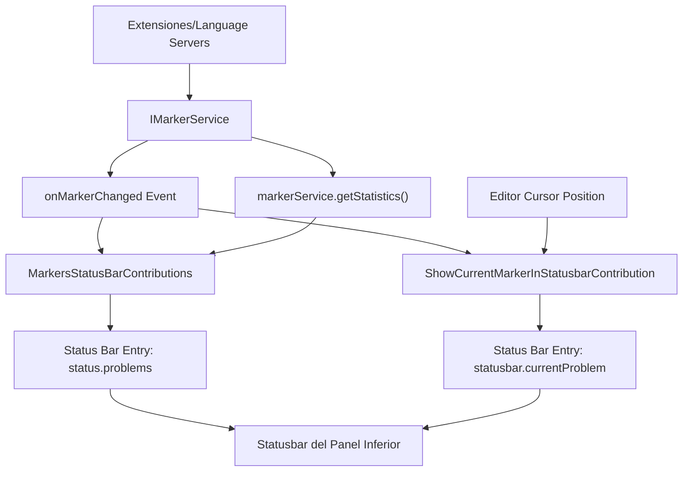

# Sistema de Errores de VS Code Conectado al Statusbar

El sistema de errores de VS Code conectado a la barra de estado (statusbar) del panel inferior funciona mediante varios componentes interconectados:

## 1. Servicio Central de Marcadores (IMarkerService)

El sistema utiliza **IMarkerService** como servicio central que gestiona todos los diagnósticos (errores, advertencias, información) a través del codebase. Este servicio almacena marcadores con información de propietario, recurso URI, severidad, mensaje y posición. [1](#0-0)

Los marcadores tienen diferentes niveles de severidad definidos en `MarkerSeverity`: Hint (1), Info (2), Warning (4) y Error (8). [2](#0-1)

## 2. Contador de Problemas en la Barra de Estado

La clase **MarkersStatusBarContributions** es responsable de mostrar el contador de errores, advertencias e información en la barra de estado. Este componente:

- Obtiene las estadísticas mediante `markerService.getStatistics()` [3](#0-2)

- Genera el texto mostrando iconos con los contadores: `$(error) 5 $(warning) 3 $(info) 2` [4](#0-3)

- Se actualiza automáticamente cuando cambian los marcadores mediante el evento `onMarkerChanged` [5](#0-4)

- Registra una entrada en la barra de estado con el ID `'status.problems'` alineada a la izquierda con prioridad 50 [6](#0-5)

- Al hacer clic, ejecuta el comando `'workbench.actions.view.toggleProblems'` para abrir/cerrar el panel de problemas [7](#0-6)

## 3. Indicador de Problema Actual

La clase **ShowCurrentMarkerInStatusbarContribution** muestra el diagnóstico actual en la posición del cursor del editor:

- Se registra como una entrada separada con ID `'statusbar.currentProblem'` [8](#0-7)

- Muestra el tipo de error (usando iconos `$(error)`, `$(warning)` o `$(info)`) seguido del mensaje [9](#0-8)

- Determina el icono según la severidad del marcador [10](#0-9)

- Se actualiza cuando cambian los marcadores o la posición del cursor [11](#0-10)

- Solo se muestra si está habilitada la configuración `'problems.showCurrentInStatus'` [12](#0-11)

## 4. Sistema de Tipos de Entrada (StatusbarEntryKind)

Las entradas de la barra de estado pueden tener un tipo (`kind`) que aplica estilos visuales específicos. Los tipos incluyen: `'standard'`, `'warning'`, `'error'`, `'prominent'`, `'remote'` y `'offline'`. [13](#0-12)

El tipo se especifica en la propiedad `kind` de la interfaz `IStatusbarEntry`: [14](#0-13)

## 5. Estilos CSS y Temas

Los estilos visuales se aplican mediante clases CSS. Para errores y advertencias:

- `.warning-kind` aplica colores de advertencia (foreground y background) [15](#0-14)

- `.error-kind` aplica colores de error [16](#0-15)

Los colores se definen como tokens temáticos:

- `STATUS_BAR_ERROR_ITEM_BACKGROUND` y `STATUS_BAR_ERROR_ITEM_FOREGROUND` para errores [17](#0-16)

- `STATUS_BAR_WARNING_ITEM_BACKGROUND` y `STATUS_BAR_WARNING_ITEM_FOREGROUND` para advertencias [18](#0-17)

## Flujo de Datos



## Notas

- El sistema utiliza **marcadores** (markers) y **diagnósticos** (diagnostics) como términos intercambiables.
- Los marcadores se almacenan por recurso y propietario (owner), permitiendo que múltiples extensiones proporcionen diagnósticos para el mismo archivo.
- El contador de problemas se registra durante la fase `LifecyclePhase.Restored` del ciclo de vida del workbench. [19](#0-18)
- Existe también un **ActivityUpdater** que muestra un badge numérico en el icono del panel de problemas en la barra de actividad. [20](#0-19)
- El sistema soporta estadísticas agregadas que incluyen errores, advertencias, información y desconocidos (unknowns). [21](#0-20)

### Citations

**File:** src/vs/platform/markers/common/markers.ts (L21-37)

```typescript
export interface IMarkerService {
 readonly _serviceBrand: undefined;

 getStatistics(): MarkerStatistics;

 changeOne(owner: string, resource: URI, markers: IMarkerData[]): void;

 changeAll(owner: string, data: IResourceMarker[]): void;

 remove(owner: string, resources: URI[]): void;

 read(filter?: IMarkerReadOptions): IMarker[];

 installResourceFilter(resource: URI, reason: string): IDisposable;

 readonly onMarkerChanged: Event<readonly URI[]>;
}
```

**File:** src/vs/platform/markers/common/markers.ts (L56-61)

```typescript
export enum MarkerSeverity {
 Hint = 1,
 Info = 2,
 Warning = 4,
 Error = 8,
}
```

**File:** src/vs/platform/markers/common/markers.ts (L146-150)

```typescript
export interface MarkerStatistics {
 errors: number;
 warnings: number;
 infos: number;
 unknowns: number;
```

**File:** src/vs/workbench/contrib/markers/browser/markers.contribution.ts (L579-579)

```typescript
  this.markersStatusItem = this._register(this.statusbarService.addEntry(this.getMarkersItem(), 'status.problems', StatusbarAlignment.LEFT, 50 /* Medium Priority */));
```

**File:** src/vs/workbench/contrib/markers/browser/markers.contribution.ts (L591-593)

```typescript
  this._register(this.markerService.onMarkerChanged(() => {
   this.markersStatusItem.update(this.getMarkersItem());
  }));
```

**File:** src/vs/workbench/contrib/markers/browser/markers.contribution.ts (L611-621)

```typescript
 private getMarkersItem(): IStatusbarEntry {
  const markersStatistics = this.markerService.getStatistics();
  const tooltip = this.getMarkersTooltip(markersStatistics);
  return {
   name: localize('status.problems', "Problems"),
   text: this.getMarkersText(markersStatistics),
   ariaLabel: tooltip,
   tooltip,
   command: 'workbench.actions.view.toggleProblems'
  };
 }
```

**File:** src/vs/workbench/contrib/markers/browser/markers.contribution.ts (L665-679)

```typescript
 private getMarkersText(stats: MarkerStatistics): string {
  const problemsText: string[] = [];

  // Errors
  problemsText.push('$(error) ' + this.packNumber(stats.errors));

  // Warnings
  problemsText.push('$(warning) ' + this.packNumber(stats.warnings));

  // Info (only if any)
  if (stats.infos > 0) {
   problemsText.push('$(info) ' + this.packNumber(stats.infos));
  }

  return problemsText.join(' ');
```

**File:** src/vs/workbench/contrib/markers/browser/markers.contribution.ts (L688-688)

```typescript
workbenchRegistry.registerWorkbenchContribution(MarkersStatusBarContributions, LifecyclePhase.Restored);
```

**File:** src/vs/workbench/contrib/markers/browser/markers.contribution.ts (L692-715)

```typescript
class ActivityUpdater extends Disposable implements IWorkbenchContribution {

 private readonly activity = this._register(new MutableDisposable<IDisposable>());

 constructor(
  @IActivityService private readonly activityService: IActivityService,
  @IMarkerService private readonly markerService: IMarkerService
 ) {
  super();
  this._register(this.markerService.onMarkerChanged(() => this.updateBadge()));
  this.updateBadge();
 }

 private updateBadge(): void {
  const { errors, warnings, infos } = this.markerService.getStatistics();
  const total = errors + warnings + infos;
  if (total > 0) {
   const message = localize('totalProblems', 'Total {0} Problems', total);
   this.activity.value = this.activityService.showViewActivity(Markers.MARKERS_VIEW_ID, { badge: new NumberBadge(total, () => message) });
  } else {
   this.activity.value = undefined;
  }
 }
}
```

**File:** src/vs/workbench/browser/parts/editor/editorStatus.ts (L1000-1005)

```typescript
    const text = `${this.getType(this.currentMarker)} ${line}`;
    if (!this.statusBarEntryAccessor.value) {
     this.statusBarEntryAccessor.value = this.statusbarService.addEntry({ name: localize('currentProblem', "Current Problem"), text, ariaLabel: text }, 'statusbar.currentProblem', StatusbarAlignment.LEFT);
    } else {
     this.statusBarEntryAccessor.value.update({ name: localize('currentProblem', "Current Problem"), text, ariaLabel: text });
    }
```

**File:** src/vs/workbench/browser/parts/editor/editorStatus.ts (L1024-1032)

```typescript
 private getType(marker: IMarker): string {
  switch (marker.severity) {
   case MarkerSeverity.Error: return '$(error)';
   case MarkerSeverity.Warning: return '$(warning)';
   case MarkerSeverity.Info: return '$(info)';
  }

  return '';
 }
```

**File:** src/vs/workbench/browser/parts/editor/editorStatus.ts (L1035-1037)

```typescript
  if (!this.configurationService.getValue<boolean>('problems.showCurrentInStatus')) {
   return null;
  }
```

**File:** src/vs/workbench/browser/parts/editor/editorStatus.ts (L1056-1071)

```typescript
 private onMarkerChanged(changedResources: readonly URI[]): void {
  if (!this.editor) {
   return;
  }

  const model = this.editor.getModel();
  if (!model) {
   return;
  }

  if (model && !changedResources.some(r => isEqual(model.uri, r))) {
   return;
  }

  this.updateMarkers();
 }
```

**File:** src/vs/workbench/services/statusbar/browser/statusbar.ts (L116-117)

```typescript
export type StatusbarEntryKind = 'standard' | 'warning' | 'error' | 'prominent' | 'remote' | 'offline';
export const StatusbarEntryKinds: StatusbarEntryKind[] = ['standard', 'warning', 'error', 'prominent', 'remote', 'offline'];
```

**File:** src/vs/workbench/services/statusbar/browser/statusbar.ts (L201-204)

```typescript
 /**
  * The kind of status bar entry. This applies different colors to the entry.
  */
 readonly kind?: StatusbarEntryKind;
```

**File:** src/vs/workbench/browser/parts/statusbar/media/statusbarpart.css (L183-191)

```css
.monaco-workbench .part.statusbar > .items-container > .statusbar-item.warning-kind {
 color: var(--vscode-statusBarItem-warningForeground);
 background-color: var(--vscode-statusBarItem-warningBackground);
}

.monaco-workbench .part.statusbar > .items-container > .statusbar-item.warning-kind a:hover:not(.disabled) {
 color: var(--vscode-statusBarItem-warningHoverForeground);
 background-color: var(--vscode-statusBarItem-warningHoverBackground) !important;
}
```

**File:** src/vs/workbench/browser/parts/statusbar/media/statusbarpart.css (L193-201)

```css
.monaco-workbench .part.statusbar > .items-container > .statusbar-item.error-kind {
 color: var(--vscode-statusBarItem-errorForeground);
 background-color: var(--vscode-statusBarItem-errorBackground);
}

.monaco-workbench .part.statusbar > .items-container > .statusbar-item.error-kind a:hover:not(.disabled) {
 color: var(--vscode-statusBarItem-errorHoverForeground);
 background-color: var(--vscode-statusBarItem-errorHoverBackground) !important;
}
```

**File:** src/vs/workbench/common/theme.ts (L361-368)

```typescript
export const STATUS_BAR_ERROR_ITEM_BACKGROUND = registerColor('statusBarItem.errorBackground', {
 dark: darken(errorForeground, .4),
 light: darken(errorForeground, .4),
 hcDark: null,
 hcLight: '#B5200D'
}, localize('statusBarErrorItemBackground', "Status bar error items background color. Error items stand out from other status bar entries to indicate error conditions. The status bar is shown in the bottom of the window."));

export const STATUS_BAR_ERROR_ITEM_FOREGROUND = registerColor('statusBarItem.errorForeground', Color.white, localize('statusBarErrorItemForeground', "Status bar error items foreground color. Error items stand out from other status bar entries to indicate error conditions. The status bar is shown in the bottom of the window."));
```

**File:** src/vs/workbench/common/theme.ts (L374-381)

```typescript
export const STATUS_BAR_WARNING_ITEM_BACKGROUND = registerColor('statusBarItem.warningBackground', {
 dark: darken(editorWarningForeground, .4),
 light: darken(editorWarningForeground, .4),
 hcDark: null,
 hcLight: '#895503'
}, localize('statusBarWarningItemBackground', "Status bar warning items background color. Warning items stand out from other status bar entries to indicate warning conditions. The status bar is shown in the bottom of the window."));

export const STATUS_BAR_WARNING_ITEM_FOREGROUND = registerColor('statusBarItem.warningForeground', Color.white, localize('statusBarWarningItemForeground', "Status bar warning items foreground color. Warning items stand out from other status bar entries to indicate warning conditions. The status bar is shown in the bottom of the window."));
```
